# Patent-AX 사용자 수준별 특허 정보 제공 시스템 구현 계획서

**작성일**: 2026-01-14
**최종 수정**: 2026-01-14 (v1.3 - LLM 기반 용어 설명 채택)
**대상 시스템**: Patent-AX v1.0.0
**PlutoLM 대체**: EXAONE-4.0.1-32B (이미 적용됨)
**문서 변환**: 폴라리스 솔루션 별도 구축 예정

## 📝 변경 이력

### v1.3 (2026-01-14) - LLM 기반 용어 설명 채택 ⭐ 권장
**변경 사유**: 사전 기반 용어 설명의 부자연스러움, 품질 의존성 문제

**주요 변경사항**:
- ❌ **제거**: 500개 용어 사전 구축 작업 (4.0 M/M 절감)
- ✅ **채택**: LLM 실시간 컨텍스트 인식 용어 설명
- ✅ **장점**: 자연스러운 문맥 설명, 신조어 자동 대응, 유지보수 불필요
- ✅ **성능**: 기존과 동일 (1.8초, 후처리 제거로 오히려 개선 가능)

**공수 변화**:
- Phase 1: 10.6 M/M → **6.6 M/M** (-4.0 M/M)
  - 종자 용어 추출 (1.0 M/M) → **제거**
  - 전문가 1차 검수 (0.5 M/M) → **제거**
  - LLM 배치 생성 (2.0 M/M) → **제거**
  - 전문가 2차 검수 (0.5 M/M) → **제거**
  - 기술요소 배치 추출만 유지 (0.3 M/M)
- **전체**: 26.6 M/M → **22.6 M/M** (-4.0 M/M)

**구현 방안**:
1. **Phase 1** (권장): 순수 LLM 실시간 생성 → 즉시 배포 가능
2. **Phase 2** (선택): 캐싱 추가로 성능 최적화
3. **Phase 3** (선택): 핵심 50개만 수동 큐레이션

**핵심 개선**:
- `LEVEL_PROMPTS_V3`: 각 레벨별로 용어 설명 가이드라인 내장
- 단일 LLM 호출로 응답 + 용어 설명 동시 생성
- 사전 구축/유지보수 부담 완전 제거

### v1.2 (2026-01-14) - 데이터 구축 프로세스 상세화
**변경 사유**: 전체 특허 대상 처리는 비현실적, 12대 국가전략기술분야로 범위 한정

**주요 추가사항**:
- ✅ **12대 국가기술분야 기반 범위 한정** (1M+ → 150K~200K)
- ✅ **특허 문서 구조 기반 용어 추출 전략** (청구항 우선순위)
- ✅ **5단계 데이터 구축 프로세스** (3.5개월 소요)
- ✅ **전문가 검수 프로세스** (1차: 용어 선정, 2차: 설명 품질)
- ✅ **자동 품질 검증 규칙** (DataQualityValidator)
- ✅ **배치 처리 시간 추정** (150K 특허 = 3.5일)

**핵심 개선**:
1. 청구항 가중치 3.0, 요약 2.5, 발명내용 2.0 차등 적용
2. 분야당 1,000건 샘플 × 12개 분야 = 12,000건 분석
3. 2,000개 후보 → 전문가 검수 → 500개 핵심 용어
4. LLM 배치 생성 + 전문가 2차 검수로 품질 확보

### v1.1 (2026-01-14) - 사용자 레벨 설정 방식 개선
**변경 사유**: 자동 감지 방식의 정확도 문제 및 불필요한 복잡도 제거

**주요 변경사항**:
- ❌ **제거**: 대화 기반 자동 리터러시 레벨 감지 (2.0 M/M 절감)
- ✅ **채택**: 가입 시 학력/직업 기반 기본 레벨 설정
- ✅ **추가**: UI 헤더 드롭다운으로 언제든 레벨 전환 가능
- ✅ **추가**: 레벨 변경 이력 추적 (선택사항)
- ✅ **추가**: 레벨별 사용 통계 분석 대시보드 (Phase 3)

**공수 변화**:
- Phase 3: 10.5 M/M → 10.0 M/M (-0.5 M/M)
- **전체**: 23.5 M/M → 23.0 M/M (-0.5 M/M)

**개선 효과**:
1. 정확도 향상: 사용자가 직접 선택하므로 100% 정확
2. 복잡도 감소: LLM 기반 분류기 불필요
3. 유연성 증가: 고등학생 중 전문가도 전문가 모드 선택 가능
4. 비용 절감: 추가 LLM 호출 불필요

### v1.0 (2026-01-14) - 초안 작성

---

## 목차

1. [개요](#1-개요)
2. [핵심 요구사항 분석](#2-핵심-요구사항-분석)
3. [현황 분석](#3-현황-분석)
4. [AI-Ready Data 정의](#4-ai-ready-data-정의)
5. [구현 영역 구분](#5-구현-영역-구분)
6. [상세 설계](#6-상세-설계)
7. [구현 우선순위](#7-구현-우선순위)
8. [검증 계획](#8-검증-계획)

---

## 1. 개요

### 1.1 목적

특허 정보의 복잡성으로 인해 사용자의 **특허 리터러시(Patent Literacy)** 수준에 따라 차별화된 경험을 제공:

1. **Easy Mode**: 학생(L1) 대상 쉬운 챗봇 인터페이스
2. **Normal Mode**: 대학생~전문가(L2-L6) 대상 수준별 맞춤 응답

### 1.2 핵심 차별화 요소

| 요소 | 설명 | 접근 방법 |
|------|------|----------|
| **수준별 UI** | Easy/Normal 모드 별도 제공 | 프론트엔드 라우팅 |
| **눈높이 맞춤 응답** | 동일 데이터, 다른 설명 방식 | 프롬프트 엔지니어링 |
| **관점별 요약** | 목적/소재/공법/효과 관점 | 데이터 구조화 + 프롬프트 |
| **용어 단계별 제공** | 쉬운말 ↔ 전문용어 매핑 | 용어 사전 + 후처리 |

---

## 2. 핵심 요구사항 분석

### 2.1 기능 요구사항

#### A. 사용자 수준별 UI 제공

```mermaid
flowchart LR
    User[사용자] --> Register[가입/프로필 설정]
    Register --> SelectLevel{기본 레벨 선택}

    SelectLevel -->|초등/중등/고등| L1[L1 또는 L2]
    SelectLevel -->|대학생/대학원생| L2[L2]
    SelectLevel -->|중소기업 실무자| L3[L3]
    SelectLevel -->|연구원| L4[L4]
    SelectLevel -->|변리사/전문가| L5[L5]
    SelectLevel -->|정책담당자| L6[L6]

    L1 --> UI[UI에서 언제든 모드 전환]
    L2 --> UI
    L3 --> UI
    L4 --> UI
    L5 --> UI
    L6 --> UI

    UI --> Easy[Easy Mode]
    UI --> Normal[Normal Mode]
    UI --> Expert[Expert Mode]
```



**요구사항**:
- [ ] 가입 시 학력/직업 기반 기본 레벨 설정
- [ ] UI 헤더에 모드 전환 드롭다운 (언제든 변경 가능)
- [ ] 사용자 프로필에 현재 레벨 저장

#### B. 눈높이 맞춤 응답 생성

**사용자 수준 정의** (기존 3단계 → 6단계 확장):

| 레벨 | 그룹명 | 대상 | 응답 특성 |
|------|--------|------|----------|
| **L1** | 학생 | 고등학생, 대학 1-2학년 | 쉬운 말, 비유, 짧은 문장, 이모지 |
| **L2** | 대학생 | 학부 3-4학년, 석·박사 | 전문용어 30%, 논문 형식, 참고문헌 |
| **L3** | 중소기업 | 중소기업 R&D, IP담당 | 실무 중심, 경쟁사 동향, 사업화 |
| **L4** | 연구자 | 출연연, 대기업 R&D | 기술 심층, 청구항 분석, 공백 발견 |
| **L5** | 전문가 | 변리사, 심사관 | 전문용어 90%, 권리범위, 선행기술 |
| **L6** | 정책담당자 | 지식재산처 정책부서 | 거시 동향, 통계, 정책 시사점 |

**현재 상태**:
- ✅ L1(초등), L2(일반인), L5(전문가) 3단계 구현됨
- ❌ L3, L4, L6 미구현
- ✅ 가입 기반 레벨 설정 방식 채택 (자동 감지 불필요)

#### C. 관점별 특허 요약

**4대 관점**:

```mermaid
flowchart TB
    Patent[특허 문서] --> Analysis[AI 분석]

    Analysis --> Purpose[🎯 목적 관점<br/>- 해결하려는 문제<br/>- 선행기술의 한계<br/>- 발명의 목표]
    Analysis --> Material[🔬 소재 관점<br/>- 사용된 재료<br/>- 화합물 조성<br/>- 물성 데이터]
    Analysis --> Process[⚙️ 공법 관점<br/>- 제조 방법<br/>- 처리 조건<br/>- 공정 순서]
    Analysis --> Effect[✨ 효과 관점<br/>- 개선 효과<br/>- 성능 향상<br/>- 기대 결과]
```



**요구사항**:
- [ ] 청구항/명세서에서 4대 관점 자동 추출
- [ ] 관점별 요약 생성
- [ ] 사용자 수준에 따라 설명 난이도 조절

#### D. 기술 용어 단계별 제공

**용어 처리 전략**:

| 수준 | 전문용어 사용률 | 용어 처리 방식 | 예시 |
|------|----------------|---------------|------|
| **L1** | 5% | 전문용어 → 쉬운말 자동 변환 | "IPC분류" → "기술 종류" |
| **L2** | 30% | 전문용어 + (괄호 설명) | "IPC분류(국제 특허 분류)" |
| **L3** | 50% | 실무 용어 중심 | "선행기술조사", "경쟁사 출원 동향" |
| **L4** | 70% | 기술 용어 그대로 | "청구항 독립항", "IPC H01M" |
| **L5** | 90% | 법률/심사 용어 | "권리범위 해석", "진보성 판단" |
| **L6** | 60% | 정책 용어 | "기술무역수지", "특허 패밀리" |

**요구사항**:
- [ ] 특허 전문용어 사전 구축 (1차: 500개 핵심 용어)
- [ ] 수준별 용어 매핑 테이블
- [ ] 응답 후처리 용어 변환 로직

---

## 3. 현황 분석

### 3.1 Patent-AX 기존 구현 현황

#### ✅ 이미 구현된 기능

| 기능 | 구현 위치 | 상태 |
|------|----------|------|
| **3단계 리터러시 레벨** | `workflow/state.py:233` | ✅ "초등", "일반인", "전문가" |
| **레벨별 프롬프트 템플릿** | `workflow/nodes/generator.py:544-565` | ✅ `LEVEL_PROMPTS` 딕셔너리 |
| **동적 프롬프트 조립** | `workflow/nodes/generator.py:869-873` | ✅ 레벨에 따라 프롬프트 선택 |
| **API 레벨 파라미터** | `api/models.py:434` | ✅ `ChatAskRequest.level` |
| **EXAONE LLM 서빙** | `llm/llm_client.py` | ✅ vLLM 서버 연동 완료 |
| **기술요소 추출 구조** | `workflow/state.py` | ✅ `rag_results`, `sql_result` |

#### ❌ 미구현 기능

| 기능 | 필요 작업 | 우선순위 |
|------|----------|----------|
| **6단계 리터러시 확장** | L3~L6 프롬프트 추가 | 높음 |
| **가입 시 레벨 설정** | 학력/직업 기반 매핑 | 높음 |
| **UI 모드 전환** | 드롭다운 컴포넌트 | 높음 |
| **관점별 요약** | 목적/소재/공법/효과 추출 | 높음 |
| **용어 사전** | 500개 핵심 용어 DB | 높음 |
| **용어 자동 변환** | 후처리 파이프라인 | 중간 |
| **문서 업로드 UI** | 폴라리스 연동 + UI | 중간 |

### 3.2 기술 스택 현황

| 구성요소 | 현재 상태 | 활용 방안 |
|----------|----------|----------|
| **LLM** | EXAONE-4.0.1-32B (vLLM 서빙) | ✅ 프롬프트 기반 구현 가능 |
| **벡터 DB** | Qdrant (1.82M patents) | ✅ 시맨틱 검색 활용 |
| **관계형 DB** | PostgreSQL (f_patents) | ✅ 구조화 데이터 저장 |
| **Graph DB** | cuGraph (현재 불가) | ⚠️ Graceful Degradation 적용됨 |
| **문서 처리** | 폴라리스 솔루션 (예정) | 🔄 별도 구축 예정 |
| **프론트엔드** | Next.js 14 | ✅ 모드별 라우팅 가능 |

---

## 4. AI-Ready Data 정의

### 4.1 데이터 vs 프롬프트 구분 원칙

```mermaid
flowchart TB
    subgraph 데이터로해결["📊 데이터 구조화 영역"]
        D1[관점별 기술요소 추출<br/>목적/소재/공법/효과]
        D2[용어 사전<br/>전문용어 ↔ 쉬운말 매핑]
        D3[특허 메타데이터<br/>IPC, 출원인, 인용 관계]
        D4[통계 데이터<br/>기술 동향, 분포]
    end

    subgraph 프롬프트로해결["🤖 프롬프트 엔지니어링 영역"]
        P1[설명 스타일 조절<br/>쉬운말/전문용어/비유]
        P2[응답 길이 조절<br/>짧게/상세하게]
        P3[예시 제공 방식<br/>일상/기술/법률]
        P4[문장 구조<br/>단순문/복문]
    end

    데이터로해결 --> Hybrid[하이브리드<br/>데이터 + 프롬프트]
    프롬프트로해결 --> Hybrid
```

### 4.2 AI-Ready Data 스키마 설계

#### A. 관점별 기술요소 테이블

**신규 테이블**: `f_patent_tech_elements`

```sql
CREATE TABLE f_patent_tech_elements (
    id SERIAL PRIMARY KEY,
    documentid VARCHAR(50) NOT NULL,  -- 특허번호 (FK)

    -- 목적 관점
    purpose_problem TEXT,              -- 해결하려는 문제
    purpose_limitation TEXT,           -- 선행기술의 한계
    purpose_goal TEXT,                 -- 발명의 목표

    -- 소재 관점
    material_compounds JSONB,          -- 화합물 목록 [{name, ratio, cas_no}]
    material_properties JSONB,         -- 물성 데이터 [{property, value, unit}]

    -- 공법 관점
    process_steps JSONB,               -- 공정 단계 [{step, condition, parameter}]
    process_conditions JSONB,          -- 처리 조건 [{temp, pressure, time}]

    -- 효과 관점
    effect_improvements JSONB,         -- 개선 효과 [{aspect, improvement, unit}]
    effect_performance JSONB,          -- 성능 데이터 [{metric, value, comparison}]

    -- 메타데이터
    extracted_at TIMESTAMP DEFAULT NOW(),
    confidence_score FLOAT,            -- 추출 신뢰도 (0.0~1.0)
    extraction_method VARCHAR(50),     -- 'llm' | 'rule-based' | 'hybrid'

    FOREIGN KEY (documentid) REFERENCES f_patents(documentid)
);

CREATE INDEX idx_patent_tech_elements_doc ON f_patent_tech_elements(documentid);
CREATE INDEX idx_patent_tech_elements_confidence ON f_patent_tech_elements(confidence_score);
```

**데이터 샘플**:

```json
{
  "documentid": "KR1020210001234",
  "purpose_problem": "기존 리튬이온 배터리의 낮은 에너지 밀도 문제",
  "purpose_limitation": "액체 전해질 사용으로 인한 안전성 우려",
  "purpose_goal": "전고체 전해질을 사용한 고에너지 밀도 배터리",
  "material_compounds": [
    {"name": "Li7La3Zr2O12", "ratio": "80%", "role": "전고체 전해질"},
    {"name": "LiNi0.8Co0.1Mn0.1O2", "ratio": "100%", "role": "양극재"}
  ],
  "material_properties": [
    {"property": "이온전도도", "value": "1.2e-3", "unit": "S/cm"},
    {"property": "에너지밀도", "value": "350", "unit": "Wh/kg"}
  ],
  "process_steps": [
    {"step": "전해질 합성", "condition": "1000℃ 소결", "time": "12시간"},
    {"step": "양극재 코팅", "condition": "스퍼터링", "parameter": "Ar 분위기"}
  ],
  "effect_improvements": [
    {"aspect": "에너지밀도", "improvement": "+30%", "comparison": "vs 기존 액체 전해질"},
    {"aspect": "안전성", "improvement": "폭발 위험 제거", "comparison": "열폭주 미발생"}
  ]
}
```

#### B. 용어 사전 테이블

**신규 테이블**: `f_patent_terms`

```sql
CREATE TABLE f_patent_terms (
    id SERIAL PRIMARY KEY,
    term VARCHAR(200) NOT NULL,         -- 전문 용어
    category VARCHAR(50),                -- 'technical' | 'legal' | 'business'

    -- 수준별 설명
    level_l1 TEXT,                       -- 학생용 쉬운말
    level_l2 TEXT,                       -- 대학생용 기초 설명
    level_l3 TEXT,                       -- 중소기업용 실무 설명
    level_l4 TEXT,                       -- 연구자용 기술 설명
    level_l5 TEXT,                       -- 전문가용 법률/심사 설명
    level_l6 TEXT,                       -- 정책담당자용 거시 설명

    -- 동의어/관련어
    synonyms JSONB,                      -- 동의어 목록
    related_terms JSONB,                 -- 관련 용어 목록

    -- 메타데이터
    ipc_codes JSONB,                     -- 관련 IPC 분류
    usage_frequency INT DEFAULT 0,       -- 사용 빈도
    created_at TIMESTAMP DEFAULT NOW(),

    UNIQUE(term)
);

CREATE INDEX idx_patent_terms_term ON f_patent_terms(term);
CREATE INDEX idx_patent_terms_category ON f_patent_terms(category);
CREATE FULLTEXT INDEX idx_patent_terms_search ON f_patent_terms(term, level_l1, level_l2);
```

**데이터 샘플**:

```json
{
  "term": "IPC 분류",
  "category": "technical",
  "level_l1": "기술 종류를 나누는 방법 (예: 자동차 기술, 배터리 기술)",
  "level_l2": "국제특허분류(International Patent Classification). 특허를 기술 분야별로 구분하는 국제 표준",
  "level_l3": "IPC 코드를 통해 경쟁사 특허 검색 및 기술 동향 파악 가능",
  "level_l4": "H01M 10/052: 리튬이차전지 등 세부 분류까지 활용한 선행기술 조사",
  "level_l5": "특허 심사 시 IPC 기반 선행기술 검색 및 거절이유 통지서 작성",
  "level_l6": "IPC 대분류별 국가 경쟁력 분석 및 기술무역수지 평가 지표",
  "synonyms": ["국제특허분류", "International Patent Classification"],
  "related_terms": ["CPC 분류", "기술 분야", "특허 검색"],
  "ipc_codes": ["*"],
  "usage_frequency": 1523
}
```

#### C. 사용자 프로필 테이블

**신규 테이블**: `f_user_profiles`

```sql
CREATE TABLE f_user_profiles (
    id SERIAL PRIMARY KEY,
    user_id VARCHAR(100) UNIQUE NOT NULL,  -- SSO 연동 사용자 ID

    -- 기본 정보 (가입 시 입력)
    education_level VARCHAR(50),            -- 초등/중등/고등/대학생/대학원생
    occupation VARCHAR(50),                 -- 학생/중소기업/연구원/변리사/정책담당자

    -- 리터러시 레벨
    registered_level VARCHAR(20) NOT NULL,  -- 가입 시 설정된 기본 레벨
    current_level VARCHAR(20) NOT NULL,     -- 현재 사용 중인 레벨 (UI에서 변경 가능)

    -- 레벨 변경 이력 (선택사항)
    level_change_history JSONB,             -- [{timestamp, from_level, to_level}]

    -- 사용 패턴
    interaction_count INT DEFAULT 0,        -- 질의 횟수
    preferred_topics JSONB,                 -- 선호 기술 분야

    -- 학습 이력
    viewed_terms JSONB,                     -- 조회한 용어 목록
    saved_patents JSONB,                    -- 북마크한 특허

    -- 메타데이터
    created_at TIMESTAMP DEFAULT NOW(),
    updated_at TIMESTAMP DEFAULT NOW(),

    CHECK (registered_level IN ('L1', 'L2', 'L3', 'L4', 'L5', 'L6')),
    CHECK (current_level IN ('L1', 'L2', 'L3', 'L4', 'L5', 'L6'))
);

CREATE INDEX idx_user_profiles_user_id ON f_user_profiles(user_id);
CREATE INDEX idx_user_profiles_current_level ON f_user_profiles(current_level);
```

### 4.3 데이터 구축 프로세스 (12대 국가기술분야 기반)

#### A. 범위 한정 전략

**12대 국가전략기술분야** (국가과학기술자문회의 지정):
1. 반도체·디스플레이
2. 이차전지
3. 백신·바이오의약품
4. 수소
5. 미래차
6. 차세대 원전
7. 첨단 로봇·제조
8. 양자기술
9. 사이버 보안
10. 우주·항공
11. 인공지능
12. 차세대 통신

**범위 한정 근거**:
- 전체 특허 1M+ → 현실적으로 처리 불가
- 12대 분야 특허 약 150K~200K → 처리 가능
- 국가 전략 분야로 사용자 관심도 높음

#### B. 특허 문서 구조 기반 용어 추출

**특허 문서의 계층 구조**:
```
특허 문서
├── 서지사항 (Bibliographic Data)
│   ├── 출원인, 발명자, IPC 분류 등
│   └── 📊 용어 추출: 기관명, 기술분류 용어
│
├── 요약 (Abstract)
│   ├── 발명의 개요 (100-200자)
│   └── 📊 용어 추출: 핵심 기술용어 (가장 높은 빈도)
│
├── 청구항 (Claims) ⭐ 최우선
│   ├── 독립항: 발명의 핵심 구성
│   ├── 종속항: 세부 실시예
│   └── 📊 용어 추출: 기술요소, 구성요소, 수치 파라미터
│
├── 발명의 상세한 설명 (Detailed Description)
│   ├── 기술분야
│   ├── 배경기술 → 📊 선행기술 용어
│   ├── 발명의 내용 → 📊 핵심 개념 용어
│   ├── 도면의 간단한 설명
│   └── 발명의 실시를 위한 구체적 내용 → 📊 실무 용어
│
└── 도면 (Drawings)
    └── 도면 부호 설명 → 📊 구성요소 용어
```

**우선순위 기반 추출 전략**:
1. **청구항 (Claims)**: 법적 권리범위 → 가장 정확한 기술용어
2. **요약 (Abstract)**: 압축된 핵심 내용 → 고빈도 핵심 용어
3. **발명의 내용**: 구체적 설명 → 실무 적용 용어

#### C. 단계별 데이터 구축 프로세스

**Phase 1: 종자 용어 추출 (1개월)**

```mermaid
flowchart TB
    Start[12대 분야 특허 선정] --> Filter[필터링]

    Filter --> IPC[IPC 코드 매핑<br/>예: H01M - 이차전지]
    Filter --> Recent[최근 5년 특허<br/>기술 최신성 확보]
    Filter --> Citation[피인용 상위 10%<br/>영향력 있는 특허]

    IPC --> Sample[샘플 선정<br/>분야당 1,000건<br/>총 12,000건]
    Recent --> Sample
    Citation --> Sample

    Sample --> Extract[구조 기반 추출]

    Extract --> Claims[청구항 용어<br/>TF-IDF 분석]
    Extract --> Abstract[요약 용어<br/>빈도 분석]
    Extract --> Desc[상세설명 용어<br/>섹션별 분석]

    Claims --> Merge[용어 병합 및 정제]
    Abstract --> Merge
    Desc --> Merge

    Merge --> Rank[빈도 × 중요도 랭킹]
    Rank --> Seed[종자 용어 2,000개<br/>분야당 150~200개]
```



**구체적 추출 로직**:

```python
# scripts/extract_seed_terms.py
class PatentTermExtractor:
    """특허 문서 구조 기반 용어 추출"""

    SECTION_WEIGHTS = {
        "claims": 3.0,        # 청구항 가중치 최고
        "abstract": 2.5,      # 요약 두번째
        "background": 1.5,    # 배경기술
        "description": 2.0,   # 발명의 내용
        "embodiment": 1.8     # 실시예
    }

    def extract_from_patent(self, patent: Dict) -> List[TermScore]:
        """특허 문서에서 가중치 기반 용어 추출"""

        # 1. 섹션별 추출
        claims_terms = self.extract_from_section(
            patent["claims"],
            section="claims"
        )

        abstract_terms = self.extract_from_section(
            patent["abstract"],
            section="abstract"
        )

        description_terms = self.extract_from_section(
            patent["description"],
            section="description"
        )

        # 2. 가중치 적용 병합
        all_terms = defaultdict(float)

        for term, score in claims_terms:
            all_terms[term] += score * self.SECTION_WEIGHTS["claims"]

        for term, score in abstract_terms:
            all_terms[term] += score * self.SECTION_WEIGHTS["abstract"]

        for term, score in description_terms:
            all_terms[term] += score * self.SECTION_WEIGHTS["description"]

        # 3. 필터링 (불용어, 일반 단어 제거)
        filtered = self.filter_general_words(all_terms)

        # 4. 랭킹
        return sorted(filtered.items(), key=lambda x: x[1], reverse=True)
```

**Phase 2: 분야별 전문가 검수 (0.5개월)**

```
12대 분야 × 전문가 1명 = 12명

검수 기준:
1. 기술적 정확성 (용어가 해당 분야 표준 용어인가?)
2. 사용 빈도 (실제 실무에서 자주 쓰이는가?)
3. 수준 적합성 (L1~L6 중 어느 레벨에서 설명이 필요한가?)
4. 중복 제거 (동의어 통합)

결과: 2,000개 → 500개 핵심 용어 (1차)
```

**Phase 3: 수준별 설명 생성 (1개월)**

```python
# scripts/generate_level_explanations.py
LEVEL_EXPLANATION_PROMPT_TEMPLATE = """
특허 용어: "{term}"
기술 분야: {tech_field}
용어 정의: {definition}

특허 문서 사용 예시:
{patent_examples}

위 용어를 사용자 수준별로 설명을 작성하세요:

L1 (초등/중등/고등학생):
- 일상 언어로 비유 사용
- 10단어 이내 짧은 문장
- 예: "휴대폰 배터리처럼..."

L2 (대학생/대학원생):
- 기초 학술 용어 사용
- 괄호 안에 영문 용어
- 논문 작성 참고 가능

L3 (중소기업 실무자):
- 실무 적용 관점
- 제품/공정과 연결
- 사업화 고려사항

L4 (연구원):
- 기술 원리 상세
- 측정 방법, 수치 범위
- IPC 코드 언급

L5 (변리사/심사관):
- 법적 정의
- 선행기술과 차이점
- 권리범위 해석

L6 (정책담당자):
- 산업 전체 맥락
- 국가별 기술 수준
- 정책적 의미

JSON 형식으로 출력:
{{
  "L1": "...",
  "L2": "...",
  ...
}}
"""

def generate_explanations_batch():
    """배치 처리로 500개 용어 설명 생성"""
    llm = get_llm_client()  # EXAONE or GPT-4

    for term in seed_terms:
        # 1. 특허 문서에서 사용 예시 추출
        examples = get_patent_usage_examples(term, limit=5)

        # 2. LLM 호출
        prompt = LEVEL_EXPLANATION_PROMPT_TEMPLATE.format(
            term=term["name"],
            tech_field=term["field"],
            definition=term["definition"],
            patent_examples="\n".join(examples)
        )

        result = llm.generate(prompt, temperature=0.3)
        explanations = json.loads(result)

        # 3. DB 저장
        save_term_explanations(term["name"], explanations)
```

**Phase 4: 전문가 검수 및 피드백 반영 (0.5개월)**

```
검수 항목:
1. 수준별 설명 적절성 (L1이 너무 어렵지는 않은가?)
2. 기술적 오류 수정
3. 누락된 핵심 정보 추가
4. 표현 개선 (더 쉽게, 더 정확하게)

방법:
- 온라인 검수 시스템 (Google Sheets 또는 전용 UI)
- 분야당 전문가 2명 교차 검수
- 피드백 반영 후 최종 승인
```

**Phase 5: 점진적 확장 (2~6개월, 지속)**

```
1차 500개 → 2차 1,000개 → 3차 2,000개

확장 기준:
1. 사용자 질의 로그 분석 (미등록 용어 빈도)
2. 신기술 출현 (예: ChatGPT → "생성형 AI" 용어 추가)
3. 분야별 불균형 해소 (특정 분야 용어 부족 시)
```

#### D. 기술요소 추출 프로세스 (4대 관점)

**범위**: 12대 분야 특허 150K~200K

```python
# embedding/extract_tech_elements_batch.py
class TechElementBatchExtractor:
    """4대 관점 기술요소 배치 추출"""

    def extract_by_field(self, tech_field: str):
        """분야별 배치 처리"""

        # 1. 해당 분야 특허 조회
        patents = self.get_patents_by_field(tech_field, limit=15000)

        # 2. 배치 크기 설정 (GPU 메모리 고려)
        batch_size = 10

        for i in range(0, len(patents), batch_size):
            batch = patents[i:i+batch_size]

            # 3. 병렬 추출 (vLLM 배치 처리)
            results = await self.llm.generate_batch([
                TECH_ELEMENT_EXTRACTION_PROMPT.format(
                    claims=p["claims"],
                    description=p["description"]
                )
                for p in batch
            ], temperature=0.1)

            # 4. 검증 및 저장
            for patent, result in zip(batch, results):
                elements = json.loads(result)
                if self.validate(elements):
                    self.save(patent["documentid"], elements)
                else:
                    logger.warning(f"검증 실패: {patent['documentid']}")
```

**처리 시간 추정**:
- 특허당 평균 2초 (LLM 추출)
- 150K 특허 × 2초 = 300K초 = 83시간 = **약 3.5일**
- GPU 서버 24시간 가동 기준

#### E. 데이터 품질 관리

**자동 검증 규칙**:

```python
class DataQualityValidator:
    """데이터 품질 자동 검증"""

    def validate_term_explanation(self, term: str, explanations: Dict) -> bool:
        """용어 설명 품질 검증"""

        # 1. 필수 레벨 존재 확인
        required_levels = ["L1", "L2", "L3", "L4", "L5", "L6"]
        if not all(level in explanations for level in required_levels):
            return False

        # 2. L1 설명 길이 제한 (10단어 이내)
        l1_word_count = len(explanations["L1"].split())
        if l1_word_count > 15:  # 여유 허용
            logger.warning(f"{term} L1 설명 너무 김: {l1_word_count}단어")
            return False

        # 3. 전문용어 비율 검증
        # L1: 5% 이하, L5: 90% 이상
        l1_tech_ratio = self.calculate_tech_term_ratio(explanations["L1"])
        if l1_tech_ratio > 0.1:
            logger.warning(f"{term} L1에 전문용어 과다: {l1_tech_ratio*100}%")
            return False

        return True

    def validate_tech_elements(self, elements: Dict) -> bool:
        """기술요소 추출 결과 검증"""

        # 1. 4대 관점 모두 존재
        required_keys = ["purpose", "material", "process", "effect"]
        if not all(key in elements for key in required_keys):
            return False

        # 2. 각 관점에 최소 1개 이상 데이터
        for key in required_keys:
            if not elements[key] or len(str(elements[key])) < 10:
                logger.warning(f"관점 '{key}' 데이터 부족")
                return False

        # 3. JSON 구조 일관성
        try:
            json.dumps(elements, ensure_ascii=False)
        except:
            return False

        return True
```

#### F. 최종 데이터 구축 일정

| Phase | 작업 | 기간 | 산출물 |
|-------|------|------|--------|
| **Phase 1** | 종자 용어 추출 (12대 분야, 12K 특허 분석) | 1개월 | 2,000개 후보 용어 |
| **Phase 2** | 전문가 1차 검수 | 0.5개월 | 500개 핵심 용어 |
| **Phase 3** | LLM 기반 수준별 설명 생성 | 1개월 | 500개 × 6레벨 = 3,000개 설명 |
| **Phase 4** | 전문가 2차 검수 (설명 품질) | 0.5개월 | 검증된 500개 용어 사전 |
| **Phase 5** | 기술요소 배치 추출 (4대 관점) | 0.5개월 | 150K 특허 기술요소 DB |
| **지속** | 점진적 확장 (사용자 피드백 기반) | 3~6개월 | 1,000개 → 2,000개 확장 |

**총 소요 기간**: 3.5개월 (핵심 500개 완성) + 지속적 확장

#### G. 용어 설명 방식 비교: 사전 vs LLM 실시간 생성

**Issue**: 사전 기반 용어 설명의 한계
1. 부자연스러운 설명 (문맥 무시)
2. 사전 품질에 좌우됨
3. 유지보수 부담 (신조어, 업데이트)
4. 경직된 표현 (고정된 템플릿)

**제안: LLM 기반 실시간 컨텍스트 인식 설명**

##### 방안 1: 순수 LLM 실시간 생성 ⭐ 권장

**장점**:
- 문맥에 맞는 자연스러운 설명
- 응답 전체와 일관성 유지
- 사전 구축/유지보수 불필요
- 신조어 자동 대응

**단점**:
- 응답 시간 약간 증가 (0.5~1초)
- 일관성 보장 어려움 (동일 용어, 다른 설명)
- LLM 호출 비용

**구현 방식**:

```python
# workflow/nodes/generator.py 확장
class LevelAwareResponseGenerator:
    """수준별 응답 생성 (용어 실시간 설명 포함)"""

    LEVEL_PROMPTS_V3 = {
        "L1": """초등학생도 이해할 수 있게 답변하세요.

**응답 가이드라인**:
- 전문용어를 쉬운 말로 바꿔 설명
  예: "IPC 분류" → "기술 종류를 나누는 방법"
  예: "양극재" → "배터리에서 전기를 만드는 물질"
- 비유를 많이 사용 ("마치 ~처럼")
- 문장을 짧게 (10단어 이내)
- 이모지 활용 🔋⚡

**중요**: 용어가 처음 나올 때 자연스럽게 풀어서 설명하세요.
예시) "이 특허는 IPC 분류 H01M에 속하는데, 이건 배터리 기술을 뜻해요 🔋"
""",

        "L2": """대학생/대학원생 수준으로 답변하세요.

**응답 가이드라인**:
- 전문용어 사용하되 괄호 안에 간단한 설명
  예: "IPC(국제특허분류)"
  예: "양극재(Cathode material, 배터리의 양극 활물질)"
- 학술적 표현 사용
- 논문 작성 참고 가능하도록

**중요**: 용어를 자연스럽게 문맥에 맞춰 설명하세요.
""",

        "L3": """중소기업 실무자 수준으로 답변하세요.

**응답 가이드라인**:
- 실무 적용 관점으로 용어 설명
  예: "IPC 분류는 경쟁사 특허 검색 시 필수입니다"
  예: "NCM 양극재는 현대차 배터리에 주로 사용됩니다"
- 사업화 가능성 언급
- 제품/공정과 연결

**중요**: 용어가 실무에서 어떻게 쓰이는지 설명하세요.
""",

        "L4": """연구자 수준으로 답변하세요.

**응답 가이드라인**:
- 기술 용어 그대로 사용
- 측정 방법, 수치 범위 포함
  예: "NCM811 양극재 (Ni 0.8, Co 0.1, Mn 0.1 비율)"
- IPC 세부 코드 활용

**중요**: 용어는 정확한 기술적 정의로 사용하세요.
""",

        "L5": """변리사/심사관 전문가 수준으로 답변하세요.

**응답 가이드라인**:
- 법률/심사 전문 용어 그대로 사용
- 권리범위, 선행기술 매핑
- 특허법 조항 언급 가능

**중요**: 용어는 법적 정의 기준으로 사용하세요.
""",

        "L6": """정책담당자 수준으로 답변하세요.

**응답 가이드라인**:
- 거시적 관점으로 용어 설명
  예: "IPC H01M 분야는 중국이 특허 출원 1위입니다"
- 산업 전체 맥락, 국가별 비교
- 정책적 시사점 도출

**중요**: 용어를 산업/정책 맥락에서 설명하세요.
"""
    }

    async def generate_response(self, state: Dict) -> str:
        """수준별 응답 생성"""
        level = state.get("level", "L2")
        query = state["query"]
        context = state["rag_results"]  # 검색된 특허 문서들

        # 1. 레벨별 프롬프트 선택
        level_instruction = self.LEVEL_PROMPTS_V3[level]

        # 2. 통합 프롬프트 구성
        full_prompt = f"""
{level_instruction}

# 사용자 질문
{query}

# 참고 자료 (특허 문서)
{format_context(context)}

위 자료를 바탕으로 사용자 질문에 답변하세요.
전문용어는 위의 가이드라인에 따라 자연스럽게 설명하세요.
"""

        # 3. LLM 호출 (단일 호출로 응답 + 용어 설명 동시 생성)
        response = await self.llm.generate(
            prompt=full_prompt,
            temperature=0.3,
            max_tokens=TOKEN_LIMITS[level]
        )

        return response
```

**성능 영향**:
- 기존: 응답 생성 (1.5초) + 용어 변환 후처리 (0.3초) = **1.8초**
- 신규: 응답 생성 단일 호출 (1.8초) = **1.8초**
- **차이 없음!** (오히려 후처리 제거로 더 빠를 수 있음)

##### 방안 2: 하이브리드 (핵심 용어만 사전, 나머지 LLM)

**장점**:
- 핵심 50개 용어는 일관성 보장 (예: "특허", "청구항", "IPC")
- 나머지는 LLM 실시간 설명
- 사전 규모 최소화 (500개 → 50개)

**단점**:
- 여전히 사전 유지보수 필요
- 복잡도 증가 (사전 조회 + LLM 호출)

**구현 방식**:

```python
# workflow/nodes/generator.py
CORE_TERMS = {
    "특허": {
        "L1": "새로운 발명을 보호하는 증명서",
        "L2": "발명에 대한 독점적 권리를 인정하는 법적 문서",
        "L5": "특허법 제2조에 따른 산업상 이용 가능한 발명의 보호권"
    },
    "청구항": {
        "L1": "발명의 핵심 내용을 설명한 부분",
        "L2": "특허의 권리범위를 정의하는 기술적 구성요소",
        "L5": "특허법 제42조 제4항에 따른 권리범위 기재사항"
    },
    # ... 핵심 50개만
}

class HybridTermExplainer:
    """하이브리드 용어 설명"""

    async def generate_response(self, state: Dict) -> str:
        level = state.get("level", "L2")
        query = state["query"]

        # 1. 핵심 용어 프롬프트에 주입
        core_term_instructions = self._build_core_term_guide(level)

        full_prompt = f"""
{LEVEL_PROMPTS_V3[level]}

# 핵심 용어 고정 설명 (반드시 이렇게 설명하세요)
{core_term_instructions}

# 나머지 용어는 문맥에 맞게 자연스럽게 설명하세요

# 사용자 질문
{query}
...
"""

        response = await self.llm.generate(full_prompt)
        return response

    def _build_core_term_guide(self, level: str) -> str:
        """핵심 용어 가이드 생성"""
        guide = []
        for term, explanations in CORE_TERMS.items():
            guide.append(f'- "{term}" → "{explanations[level]}"')
        return "\n".join(guide)
```

##### 방안 3: 캐싱 기반 LLM 설명 (성능 최적화)

**개념**:
- 첫 응답 시 LLM이 생성한 용어 설명을 캐싱
- 동일 용어 재사용 시 캐시 활용
- 자연스럽게 "사전"이 축적됨

**장점**:
- 초기 사전 구축 불필요
- 실제 사용 패턴 기반 용어 축적
- 일관성 점진적 향상
- 인기 용어는 빠른 응답

**구현**:

```python
class CachedLLMTermExplainer:
    """캐싱 기반 LLM 용어 설명"""

    def __init__(self):
        self.redis_client = get_redis_client()

    async def generate_response_with_cache(self, state: Dict) -> str:
        level = state["level"]
        query = state["query"]

        # 1. 응답 생성
        response = await self.llm.generate(prompt, temperature=0.3)

        # 2. 응답에서 용어 설명 추출 (선택사항)
        # 예: "IPC 분류(국제 특허 분류)"에서 추출
        term_explanations = self._extract_term_explanations(response, level)

        # 3. 캐싱 (TTL 30일)
        for term, explanation in term_explanations.items():
            cache_key = f"term:{term}:{level}"
            self.redis_client.setex(
                cache_key,
                30 * 24 * 3600,  # 30일
                explanation
            )

        return response

    def _extract_term_explanations(self, response: str, level: str) -> Dict:
        """응답에서 용어 설명 추출 (후처리)"""
        # 괄호 설명 패턴: "IPC(국제 특허 분류)"
        pattern = r'(\w+)\(([^)]+)\)'
        matches = re.findall(pattern, response)
        return {term: explanation for term, explanation in matches}
```

##### 권장 방안: **방안 1 (순수 LLM)** + 선택적 **방안 3 (캐싱)**

**최종 구현 전략**:

1. **Phase 1**: 순수 LLM 실시간 생성 (사전 구축 불필요)
   - 개발 공수 최소화
   - 즉시 배포 가능
   - 자연스러운 응답

2. **Phase 2** (선택사항): 캐싱 추가
   - 인기 용어 자동 축적
   - 응답 속도 개선
   - 일관성 점진적 향상

3. **Phase 3** (선택사항): 핵심 50개만 수동 큐레이션
   - "특허", "청구항" 등 초고빈도 용어만
   - 전문가 검수로 품질 보장

**공수 절감**:
- 용어 사전 구축 (6.3 M/M 중 4.0 M/M) → **0 M/M**
- Phase 1 전체: 10.6 M/M → **6.6 M/M** (4.0 M/M 절감)
- 전체 프로젝트: 26.6 M/M → **22.6 M/M**

---

## 5. 구현 영역 구분

### 5.1 프롬프트로 해결할 영역

#### A. 응답 스타일 조절

**구현 위치**: `workflow/nodes/generator.py`

**기존 코드 확장**:

```python
# 현재: 3단계 (초등, 일반인, 전문가)
LEVEL_PROMPTS = {
    "초등": "...",
    "일반인": "...",
    "전문가": "..."
}

# 확장: 6단계
LEVEL_PROMPTS_V2 = {
    "L1": """친절한 선생님처럼 초등학생도 이해할 수 있게:
    - 전문용어 → 쉬운말 ("특허" → "새로운 발명을 보호하는 증명서")
    - 비유 많이 사용 (예: "배터리는 휴대폰 충전기처럼...")
    - 짧은 문장 (10단어 이내)
    - 이모지 활발히 사용 🔋⚡
    - 결과는 표로 정리하되, 각 항목마다 한줄 설명 추가""",

    "L2": """대학생/대학원생 수준:
    - 전문용어 사용하되 괄호 안에 설명 (예: "IPC분류(국제 특허 분류)")
    - 논문 작성 참고 가능하도록 학술적 표현
    - 참고문헌 형식으로 특허번호 표시
    - 관련 논문이나 선행기술 연계 설명""",

    "L3": """중소기업 R&D 실무자 수준:
    - 실무 중심 용어 (선행기술조사, 경쟁사 동향)
    - 사업화 가능성 관점 추가
    - 기술 적용 시 고려사항 제시
    - 경쟁사 출원 패턴 분석""",

    "L4": """연구자/대기업 R&D 수준:
    - 기술요소 상세 분석 (소재, 공법, 물성)
    - 청구항 구조 설명 및 권리범위 분석
    - 기술 공백 영역 및 개선 가능성 제시
    - IPC 세부 분류 활용""",

    "L5": """변리사/심사관 전문가 수준:
    - 전문 법률/심사 용어 그대로 사용
    - 선행기술 매핑 및 신규성/진보성 판단
    - 거절이유 검토 관점
    - 권리범위 해석 및 침해 여부 분석""",

    "L6": """정책담당자 거시 분석 수준:
    - 기술 동향 통계 중심
    - 국가별/분야별 경쟁력 비교
    - 정책적 시사점 도출
    - 기술무역수지, 특허 패밀리 등 거시 지표"""
}
```

**max_tokens 조절**:

```python
# 수준별 응답 길이 조절
TOKEN_LIMITS = {
    "L1": 1000,   # 짧고 간결
    "L2": 2000,   # 중간
    "L3": 2500,   # 실무 상세
    "L4": 3500,   # 기술 심층
    "L5": 4000,   # 전문 분석
    "L6": 2500    # 통계 중심
}
```

#### B. 예시 제공 방식

**프롬프트에 포함**:

```python
EXAMPLE_STYLES = {
    "L1": """
    예시를 들 때는 일상생활과 연결:
    - "이 기술은 마치 휴대폰 배터리를 더 오래 쓸 수 있게 하는 거예요!"
    - "우리가 쓰는 전기차에 이런 배터리가 들어가요"
    """,

    "L3": """
    예시를 들 때는 사업 적용 사례 중심:
    - "삼성SDI가 이 기술로 NCM811 양극재를 상용화했습니다"
    - "현대차 아이오닉5에 적용된 배터리 기술입니다"
    """,

    "L5": """
    예시를 들 때는 판례나 심사 사례:
    - "특허법원 2020허1234 판결에서 유사 기술의 진보성이 부정되었습니다"
    - "심사기준 3.4.2항에 따라 청구항 해석 시..."
    """
}
```

### 5.2 데이터로 해결할 영역

#### A. 관점별 기술요소 추출

**구현 위치**: 신규 모듈 `workflow/extractors/tech_elements.py`

**처리 흐름**:

```mermaid
flowchart LR
    Patent[특허 문서] --> Extractor[TechElementExtractor]

    Extractor --> LLM[EXAONE LLM<br/>구조화 추출]
    LLM --> Parse[JSON 파싱]

    Parse --> DB[(f_patent_tech_elements)]

    DB --> Cache[Redis 캐시]
    Cache --> API[API 응답]
```



**추출 프롬프트** (구조화 출력):

```python
TECH_ELEMENT_EXTRACTION_PROMPT = """
특허 문서를 읽고 다음 4가지 관점에서 핵심 정보를 추출하세요.

# 입력 문서
청구항: {claims}
상세설명: {description}

# 출력 형식 (JSON)
{{
  "purpose": {{
    "problem": "해결하려는 문제",
    "limitation": "선행기술의 한계",
    "goal": "발명의 목표"
  }},
  "material": {{
    "compounds": [
      {{"name": "화합물명", "ratio": "조성비", "role": "역할"}}
    ],
    "properties": [
      {{"property": "물성명", "value": "값", "unit": "단위"}}
    ]
  }},
  "process": {{
    "steps": [
      {{"step": "공정명", "condition": "조건", "parameter": "파라미터"}}
    ]
  }},
  "effect": {{
    "improvements": [
      {{"aspect": "개선 측면", "improvement": "개선 정도", "comparison": "비교 대상"}}
    ]
  }}
}}

# 제약사항
- 문서에 없는 내용은 추측하지 말 것
- 수치는 정확히 추출 (단위 포함)
- 화합물명은 IUPAC 표준명 또는 문서 원문 그대로
"""
```

**배치 처리 스크립트**:

```python
# embedding/extract_tech_elements.py (신규)
import asyncio
from llm.llm_client import get_llm_client
from sql.db_connector import get_db_connection

async def extract_all_patents():
    """전체 특허 기술요소 배치 추출"""
    llm = get_llm_client()
    conn = get_db_connection()
    cursor = conn.cursor()

    # 미추출 특허 조회
    cursor.execute("""
        SELECT p.documentid, p.conts_klang_nm, p.patent_abstc_ko
        FROM f_patents p
        LEFT JOIN f_patent_tech_elements e ON p.documentid = e.documentid
        WHERE e.id IS NULL
        LIMIT 1000
    """)

    patents = cursor.fetchall()

    for patent in patents:
        doc_id, title, abstract = patent

        # LLM 호출 (구조화 추출)
        result = await llm.generate(
            prompt=TECH_ELEMENT_EXTRACTION_PROMPT.format(
                claims=get_claims(doc_id),
                description=get_description(doc_id)
            ),
            max_tokens=2000,
            temperature=0.1  # 낮은 온도로 정확성 확보
        )

        # JSON 파싱 및 저장
        elements = json.loads(result)
        save_tech_elements(doc_id, elements)

    conn.close()
```

#### B. 용어 사전 구축

**1차 용어 목록 (500개 우선순위)**:

| 분류 | 용어 예시 | 개수 |
|------|----------|------|
| **기본 개념** | 특허, 출원, 등록, 청구항, 명세서, 도면 | 50 |
| **검색/분류** | IPC, CPC, 키워드 검색, 시맨틱 검색 | 30 |
| **기술 용어** | 리튬이온, 양극재, 전해질, 소재, 공법 | 150 |
| **법률 용어** | 신규성, 진보성, 권리범위, 침해, 거절이유 | 80 |
| **비즈니스** | 선행기술조사, 특허맵, 기술동향, 경쟁사 분석 | 90 |
| **통계 지표** | 출원 건수, 등록률, 인용 횟수, 기술무역수지 | 100 |

**수집 방법**:

```python
# scripts/build_term_dictionary.py (신규)
def collect_frequent_terms():
    """특허 문서에서 빈출 용어 추출"""
    # 1. TF-IDF 기반 특허 고유 용어 추출
    # 2. IPC 코드별 대표 용어 추출
    # 3. 전문가 검토 목록과 병합
    pass

def generate_level_explanations(term):
    """GPT-4로 6단계 설명 생성"""
    prompt = f"""
    특허 용어 "{term}"에 대해 사용자 수준별로 설명을 작성하세요.

    L1 (학생): 초등학생도 이해할 수 있는 쉬운 말로
    L2 (대학생): 학술적이지만 기초적인 설명
    L3 (중소기업): 실무 적용 관점의 설명
    L4 (연구자): 기술적으로 상세한 설명
    L5 (전문가): 법률/심사 관점의 전문 설명
    L6 (정책담당자): 거시적/통계적 관점의 설명

    JSON 형식으로 출력:
    {{
      "L1": "...",
      "L2": "...",
      ...
    }}
    """
    # GPT-4 호출 후 검수
    return explanations
```

#### C. 용어 자동 변환 후처리

**구현 위치**: `workflow/nodes/generator.py` (응답 생성 후)

```python
def post_process_response(response: str, level: str) -> str:
    """응답에서 용어를 사용자 수준에 맞게 변환"""
    conn = get_db_connection()
    cursor = conn.cursor()

    # 응답에 포함된 전문용어 탐지
    cursor.execute("""
        SELECT term, level_{level} as explanation
        FROM f_patent_terms
        WHERE term = ANY(%s)
    """, (extract_terms(response),))

    term_map = {row[0]: row[1] for row in cursor.fetchall()}

    # L1, L2의 경우 용어 변환 또는 설명 추가
    if level in ["L1", "L2"]:
        for term, explanation in term_map.items():
            if level == "L1":
                # 완전 치환
                response = response.replace(term, explanation)
            else:  # L2
                # 괄호 설명 추가
                response = response.replace(term, f"{term}({explanation})")

    conn.close()
    return response
```

### 5.3 하이브리드 영역 (데이터 + 프롬프트)

#### A. 관점별 요약 생성

**데이터**: `f_patent_tech_elements`에서 추출된 구조화 정보
**프롬프트**: 수준별 설명 스타일 적용

```python
def generate_perspective_summary(doc_id: str, perspective: str, level: str) -> str:
    """관점별 요약 생성 (하이브리드)"""

    # 1. 구조화 데이터 조회
    elements = get_tech_elements(doc_id)

    # 2. 관점별 데이터 선택
    if perspective == "purpose":
        data = elements["purpose"]
    elif perspective == "material":
        data = elements["material"]
    # ...

    # 3. 수준별 프롬프트 적용
    prompt = f"""
    다음 데이터를 {level} 수준 사용자에게 설명하세요.

    데이터: {json.dumps(data, ensure_ascii=False)}

    {LEVEL_PROMPTS_V2[level]}
    """

    # 4. LLM 호출
    return llm.generate(prompt)
```

---

## 6. 상세 설계

### 6.1 아키텍처 다이어그램

```mermaid
flowchart TB
    subgraph Frontend["프론트엔드"]
        EasyUI[Easy Mode UI<br/>/easy 라우트]
        NormalUI[Normal Mode UI<br/>/chat 라우트]
        Upload[문서 업로드]
    end

    subgraph Backend["백엔드 (FastAPI)"]
        Router[API Router<br/>/chat/ask]
        LevelDetector[수준 감지기<br/>LevelDetector]
        Workflow[LangGraph<br/>Workflow]
    end

    subgraph AILayer["AI 레이어"]
        EXAONE[EXAONE-4.0.1<br/>vLLM 서빙]
        Extractor[기술요소<br/>추출기]
        TermProcessor[용어 변환<br/>후처리기]
    end

    subgraph DataLayer["데이터 레이어"]
        PatentDB[(f_patents<br/>PostgreSQL)]
        TechElementDB[(f_patent_tech_elements<br/>PostgreSQL)]
        TermDB[(f_patent_terms<br/>PostgreSQL)]
        VectorDB[(patents_v3<br/>Qdrant)]
    end

    EasyUI --> Router
    NormalUI --> Router
    Upload --> Polaris[폴라리스<br/>문서 변환]

    Router --> LevelDetector
    LevelDetector --> Workflow

    Workflow --> EXAONE
    Workflow --> Extractor
    Workflow --> TermProcessor

    EXAONE --> TechElementDB
    Extractor --> TechElementDB
    TermProcessor --> TermDB

    Workflow --> PatentDB
    Workflow --> VectorDB

    Polaris --> TechElementDB
```



### 6.2 API 설계

#### A. 기존 API 확장

**파일**: `api/routers/ax_api.py`

```python
# 현재 구현 (3단계)
class ChatAskRequest(BaseModel):
    level: Literal["초등", "일반인", "전문가"] = "일반인"
    question: str = Field(..., max_length=2000)

# 확장 (6단계)
class ChatAskRequestV2(BaseModel):
    level: Literal["L1", "L2", "L3", "L4", "L5", "L6"]  # 사용자 프로필에서 가져옴
    question: str = Field(..., max_length=2000)
    user_id: str  # SSO 연동 (필수)
    mode: Literal["easy", "normal", "expert"] = "normal"

    # 관점별 요약 요청 (선택)
    perspectives: Optional[List[Literal["purpose", "material", "process", "effect"]]] = None
```

#### B. 신규 엔드포인트

```python
@router.post("/user/set-level")
async def set_user_level(user_id: str, level: str):
    """사용자 레벨 변경 (UI 드롭다운에서 호출)"""
    conn = get_db_connection()
    cursor = conn.cursor()

    # 기존 레벨 조회
    cursor.execute("SELECT current_level FROM f_user_profiles WHERE user_id = %s", (user_id,))
    old_level = cursor.fetchone()[0]

    # 레벨 변경
    cursor.execute("""
        UPDATE f_user_profiles
        SET current_level = %s,
            level_change_history = level_change_history || %s::jsonb,
            updated_at = NOW()
        WHERE user_id = %s
    """, (level, json.dumps([{"timestamp": datetime.now().isoformat(), "from": old_level, "to": level}]), user_id))

    conn.commit()
    conn.close()
    return {"success": True, "new_level": level}

@router.post("/chat/perspective-summary")
async def get_perspective_summary(request: PerspectiveSummaryRequest):
    """특허 문서의 관점별 요약 제공"""
    # request: {doc_id, perspective, level}
    extractor = TechElementExtractor()
    elements = await extractor.get_elements(request.doc_id)

    generator = PerspectiveSummaryGenerator()
    summary = await generator.generate(
        elements=elements,
        perspective=request.perspective,
        level=request.level
    )
    return {"summary": summary}

@router.get("/terms/{term}")
async def get_term_explanation(term: str, level: str):
    """특정 용어의 수준별 설명 조회"""
    conn = get_db_connection()
    cursor = conn.cursor()
    cursor.execute(f"""
        SELECT level_{level} FROM f_patent_terms WHERE term = %s
    """, (term,))
    result = cursor.fetchone()
    conn.close()

    if result:
        return {"term": term, "explanation": result[0]}
    else:
        return {"error": "Term not found"}
```

### 6.3 핵심 모듈 설계

#### A. 사용자 레벨 매핑 로직

**신규 파일**: `workflow/user/level_mapper.py`

```python
class UserLevelMapper:
    """가입 정보 기반 리터러시 레벨 매핑"""

    LEVEL_MAPPING = {
        # 학력 기반
        "초등학생": "L1",
        "중학생": "L1",
        "고등학생": "L2",
        "대학생": "L2",
        "대학원생": "L2",

        # 직업 기반
        "중소기업_실무자": "L3",
        "대기업_R&D": "L4",
        "연구원": "L4",
        "변리사": "L5",
        "심사관": "L5",
        "특허전문가": "L5",
        "정책담당자": "L6"
    }

    @classmethod
    def get_initial_level(cls, education_level: str, occupation: str) -> str:
        """가입 시 기본 레벨 결정"""
        # 1. 직업 우선 (더 구체적)
        if occupation in cls.LEVEL_MAPPING:
            return cls.LEVEL_MAPPING[occupation]

        # 2. 학력으로 판단
        if education_level in cls.LEVEL_MAPPING:
            return cls.LEVEL_MAPPING[education_level]

        # 3. 기본값
        return "L2"  # 일반 사용자

    @classmethod
    async def create_user_profile(cls, user_id: str, education_level: str, occupation: str):
        """신규 사용자 프로필 생성"""
        initial_level = cls.get_initial_level(education_level, occupation)

        conn = get_db_connection()
        cursor = conn.cursor()

        cursor.execute("""
            INSERT INTO f_user_profiles (user_id, education_level, occupation, registered_level, current_level)
            VALUES (%s, %s, %s, %s, %s)
        """, (user_id, education_level, occupation, initial_level, initial_level))

        conn.commit()
        conn.close()

        return initial_level
```

#### B. 기술요소 추출기

**신규 파일**: `workflow/extractors/tech_elements.py`

```python
class TechElementExtractor:
    """특허 문서에서 4대 관점 기술요소 추출"""

    async def extract(self, doc_id: str) -> Dict[str, Any]:
        """구조화된 기술요소 추출"""

        # 1. 캐시 확인
        cached = self._get_cached(doc_id)
        if cached:
            return cached

        # 2. 문서 조회
        patent = self._get_patent(doc_id)

        # 3. LLM 구조화 추출
        llm = get_llm_client()
        result = await llm.generate(
            prompt=TECH_ELEMENT_EXTRACTION_PROMPT.format(
                claims=patent["claims"],
                description=patent["description"]
            ),
            max_tokens=2000,
            temperature=0.1
        )

        # 4. JSON 파싱
        elements = json.loads(result)

        # 5. 검증 및 저장
        if self._validate(elements):
            self._save_to_db(doc_id, elements)
            self._cache(doc_id, elements)

        return elements

    def _validate(self, elements: Dict) -> bool:
        """추출 결과 검증"""
        required_keys = ["purpose", "material", "process", "effect"]
        return all(k in elements for k in required_keys)
```

#### C. 레벨 전환 UI 컴포넌트

**신규 파일**: `frontend/components/LevelSwitcher.tsx`

```typescript
interface LevelSwitcherProps {
  userId: string;
  currentLevel: string;
  onLevelChange: (newLevel: string) => void;
}

export function LevelSwitcher({ userId, currentLevel, onLevelChange }: LevelSwitcherProps) {
  const levels = [
    { value: "L1", label: "쉬운 설명 (학생)" },
    { value: "L2", label: "기본 설명 (대학생)" },
    { value: "L3", label: "실무 중심 (중소기업)" },
    { value: "L4", label: "기술 상세 (연구자)" },
    { value: "L5", label: "전문가 (변리사)" },
    { value: "L6", label: "정책 동향 (담당자)" }
  ];

  const handleChange = async (newLevel: string) => {
    // API 호출: 레벨 변경 저장
    await fetch("/api/user/set-level", {
      method: "POST",
      body: JSON.stringify({ user_id: userId, level: newLevel })
    });

    onLevelChange(newLevel);
  };

  return (
    <div className="level-switcher">
      <select value={currentLevel} onChange={(e) => handleChange(e.target.value)}>
        {levels.map((level) => (
          <option key={level.value} value={level.value}>
            {level.label}
          </option>
        ))}
      </select>
    </div>
  );
}
```

#### D. 용어 변환 후처리기

**신규 파일**: `workflow/processors/term_processor.py`

```python
class TermProcessor:
    """응답에서 용어를 수준별로 변환"""

    def __init__(self):
        self.term_cache = self._load_term_dict()

    def process(self, response: str, level: str) -> str:
        """수준별 용어 변환"""

        if level in ["L4", "L5"]:
            # 전문가는 변환 불필요
            return response

        # 1. 용어 탐지 (정규식 + NER)
        detected_terms = self._detect_terms(response)

        # 2. 수준별 설명 조회
        term_map = {}
        for term in detected_terms:
            if term in self.term_cache:
                explanation = self.term_cache[term].get(f"level_{level}")
                if explanation:
                    term_map[term] = explanation

        # 3. 변환 적용
        if level == "L1":
            # 완전 치환
            for term, explanation in term_map.items():
                response = response.replace(term, explanation)
        elif level in ["L2", "L3"]:
            # 괄호 설명 추가
            for term, explanation in term_map.items():
                # 이미 괄호가 있으면 스킵
                if f"{term}(" not in response:
                    response = response.replace(term, f"{term}({explanation})", 1)

        return response

    def _detect_terms(self, text: str) -> Set[str]:
        """텍스트에서 전문용어 탐지"""
        # 1. 용어 사전 매칭 (빠른 방법)
        terms = set()
        for term in self.term_cache.keys():
            if term in text:
                terms.add(term)

        # 2. NER 기반 탐지 (선택적)
        # ner_terms = self._ner_extract(text)
        # terms.update(ner_terms)

        return terms
```

### 6.4 프론트엔드 라우팅

#### Easy Mode (`/easy`)

```typescript
// frontend/app/easy/page.tsx (신규)
export default function EasyModePage() {
  return (
    <div className="easy-mode">
      <ChatInterface
        mode="easy"
        level="L1"
        features={{
          showFilters: false,
          showDocumentUpload: false,
          showRecommendedQuestions: true,
          showTermPopup: true,
          useEmoji: true
        }}
      />
    </div>
  );
}
```

#### Normal Mode (`/chat`)

```typescript
// frontend/app/chat/page.tsx (기존 확장)
export default function ChatPage() {
  const [level, setLevel] = useState<string>("L2"); // 기본값
  const [autoDetect, setAutoDetect] = useState(true);

  return (
    <div className="normal-mode">
      <LevelSelector
        level={level}
        onChange={setLevel}
        autoDetect={autoDetect}
        onAutoDetectChange={setAutoDetect}
      />

      <ChatInterface
        mode="normal"
        level={level}
        features={{
          showFilters: true,
          showDocumentUpload: true,
          showPerspectiveSummary: true,
          showAdvancedAnalysis: level >= "L4"
        }}
      />
    </div>
  );
}
```

---

## 7. 구현 우선순위

### 7.1 Phase 1: 핵심 인프라 및 데이터 구축 (1~4월)

#### 1-A. 데이터 구축 (병렬 진행, 0.5개월)

**v1.3 변경**: 용어 사전 구축 제거 (LLM 실시간 생성 채택)

| 순위 | 작업 | 담당 | M/M | 비고 |
|------|------|------|-----|------|
| 1 | 기술요소 배치 추출 (4대 관점) | Wert | 0.3 | 150K 특허, GPU 3.5일 가동 |

**소계 (데이터 구축): 0.3 M/M**

**제거된 작업** (4.0 M/M 절감):
- ~~12대 분야 특허 샘플링~~ (0.3 M/M) → 불필요 (전체 특허 대상)
- ~~특허 구조 기반 용어 추출 스크립트~~ (1.0 M/M) → 불필요 (LLM이 실시간 처리)
- ~~종자 용어 추출 실행~~ (0.5 M/M) → 불필요
- ~~전문가 1차 검수 (용어 선정)~~ (1.0 M/M) → 불필요
- ~~LLM 기반 수준별 설명 생성~~ (1.5 M/M) → 불필요 (실시간 생성)
- ~~전문가 2차 검수 (설명 품질)~~ (0.5 M/M) → 불필요
- ~~데이터 품질 검증 자동화~~ (0.2 M/M) → 불필요

#### 1-B. 시스템 구현 (병렬 진행, 2개월)

**v1.3 변경**: 용어 사전 관련 모듈 제거

| 순위 | 작업 | 담당 | M/M | 비고 |
|------|------|------|-----|------|
| 1 | 6단계 리터러시 프롬프트 작성 (LEVEL_PROMPTS_V3) | Wert | 1.5 | L3~L6 추가 + 용어 설명 가이드라인 내장 |
| 2 | 기술요소 추출 테이블 설계 | Wert | 0.5 | f_patent_tech_elements 스키마 |
| 3 | 사용자 프로필 테이블 설계 | Wert | 0.3 | f_user_profiles 스키마 |
| 4 | 레벨 매핑 로직 구현 | Wert | 0.5 | UserLevelMapper |
| 5 | 응답 생성 통합 | Wert | 0.5 | LevelAwareResponseGenerator |

**소계 (시스템 구현): 3.3 M/M**

**제거된 작업** (1.0 M/M 절감):
- ~~용어 사전 테이블 설계 및 구축~~ (0.5 M/M) → 불필요
- ~~용어 변환 후처리 모듈~~ (1.5 M/M) → 불필요 (LLM이 응답에 포함)

**Phase 1 전체: 3.6 M/M** (데이터 구축 0.3 M/M + 시스템 구현 3.3 M/M)

### 7.2 Phase 2: UI 구현 (2~4월)

| 순위 | 작업 | 담당 | M/M | 비고 |
|------|------|------|-----|------|
| 1 | Easy Mode UI 라우팅 | 아프로시스 | 1.5 | /easy 경로 |
| 2 | 레벨 전환 드롭다운 | 아프로시스 | 0.5 | 헤더 영역, 언제든 변경 가능 |
| 3 | 가입 시 학력/직업 입력 폼 | 아프로시스 | 0.5 | 레벨 자동 매핑 |
| 4 | 관점별 요약 UI | 아프로시스 | 2.0 | 목적/소재/공법/효과 탭 |
| 5 | 용어 팝업 컴포넌트 | 아프로시스 | 1.0 | 클릭 시 설명 표시 |
| 6 | 추천 질문 UI | 아프로시스 | 0.5 | Easy Mode용 |

**소계: 6.0 M/M**

### 7.3 Phase 3: 고도화 (4~7월)

| 순위 | 작업 | 담당 | M/M | 비고 |
|------|------|------|-----|------|
| 1 | 사용자 프로필 관리 | Wert | 1.5 | 학습 이력 추적 |
| 2 | 문서 업로드 연동 | 폴라리스 | 3.0 | OCR + 기술요소 추출 |
| 3 | 관점별 요약 생성 API | Wert | 2.0 | 하이브리드 방식 |
| 4 | A/B 테스트 및 개선 | 케이원 | 2.0 | 파일럿 피드백 |
| 5 | 레벨별 통계 분석 대시보드 | 아프로시스 | 1.5 | 사용 패턴 분석 |

**소계: 10.0 M/M** (기존 10.5 M/M에서 0.5 M/M 절감)

### 7.4 총 투입 공수

| Phase | 기간 | M/M | 변경사항 (v1.3) |
|-------|------|-----|----------------|
| Phase 1: 핵심 인프라 + 데이터 구축 | 1~2월 | 3.6 | **-7.0 M/M** (용어 사전 구축 제거) |
| Phase 2: UI 구현 | 2~4월 | 6.0 | 변경 없음 |
| Phase 3: 고도화 | 4~7월 | 10.0 | 변경 없음 |
| **합계** | | **19.6 M/M** | **총 -7.0 M/M** |

**Phase 1 상세 (v1.3 최종)**:
- ✅ **데이터 구축 (0.3 M/M)**:
  - 기술요소 배치 추출 (4대 관점) (0.3 M/M)
  - ~~용어 사전 구축 제거~~ (-4.0 M/M)
- ✅ **시스템 구현 (3.3 M/M)**:
  - 수준별 프롬프트 작성 (LEVEL_PROMPTS_V3) (1.5 M/M)
  - 테이블 설계 (f_patent_tech_elements, f_user_profiles) (0.8 M/M)
  - 레벨 매핑 로직 (UserLevelMapper) (0.5 M/M)
  - 응답 생성 통합 (LevelAwareResponseGenerator) (0.5 M/M)
  - ~~용어 변환 후처리 제거~~ (-1.0 M/M)

**실제 기간 단축**:
- Phase 1: 4개월 → **2개월** (용어 사전 구축 제거로 대폭 단축)
- 전체: 7개월 변동 없음 (Phase 2, 3 병렬 진행)

**이전 버전 대비 변경**:
- v1.0 → v1.1: -0.5 M/M (자동 감지 제거)
- v1.1 → v1.2: +3.6 M/M (데이터 구축 프로세스 상세화)
- v1.2 → v1.3: **-7.0 M/M** (용어 사전 구축 제거, LLM 실시간 생성 채택)
- **최종**: 23.5 M/M (v1.0) → 23.0 M/M (v1.1) → 26.6 M/M (v1.2) → **19.6 M/M (v1.3)** ⭐

---

## 8. 검증 계획

### 8.1 품질 지표

| 항목 | 측정 방법 | 목표치 | 비고 |
|------|----------|--------|------|
| **기술요소 추출 정확도** | 전문가 검수 (샘플 100건) | 85% 이상 | 목적/소재/공법/효과 4관점 |
| **용어 설명 적절성** | 사용자 만족도 설문 | 4.0/5.0 이상 | 레벨별 5점 척도 |
| **응답 이해도** | 이해도 자가 평가 | L1: 90%, L5: 95% | 각 레벨별 목표 |
| **처리 시간** | API 응답 시간 | 3초 이내 | 95th percentile |
| **용어 변환 정확도** | 자동 테스트 | 95% 이상 | 오변환 검출 |

### 8.2 테스트 시나리오

#### A. Easy Mode 테스트

```
시나리오: 고등학생이 배터리 기술 탐색
1. /easy 접속
2. "배터리 오래 쓰는 기술 뭐 있어?" 질문
3. 응답 확인:
   - 쉬운 말로 설명 (전문용어 5% 이하)
   - 비유 사용
   - 이모지 포함
   - 추천 질문 3개 표시
4. 용어 클릭 시 팝업 확인
```

#### B. Normal Mode 수준별 테스트

```
시나리오: 동일 질문 "리튬이온 배터리 기술 동향"

L2 (대학생):
- 전문용어 30%, 괄호 설명
- 논문 참고 가능 형식
- 학술적 표현

L4 (연구자):
- 기술요소 상세 분석
- 청구항 구조 설명
- IPC 세부 분류 활용

L5 (전문가):
- 법률 용어 그대로
- 선행기술 매핑
- 권리범위 해석
```

#### C. 관점별 요약 테스트

```
특허: KR1020210001234 (전고체 배터리)

목적 관점:
- L1: "기존 배터리의 폭발 위험을 없애려고 했어요"
- L4: "액체 전해질의 열폭주 문제 해결을 목적으로 전고체 전해질 적용"

소재 관점:
- L1: "특별한 세라믹 재료를 사용했어요"
- L4: "Li7La3Zr2O12 (LLZO) 가넷 구조 전고체 전해질, 이온전도도 1.2×10⁻³ S/cm"
```

### 8.3 파일럿 테스트 계획

**기간**: 2025년 6~7월
**참여**: 지산학연 50명

| 그룹 | 인원 | 테스트 내용 |
|------|------|------------|
| **학생** (L1) | 10명 | Easy Mode 사용성, 이해도 |
| **대학생** (L2) | 10명 | 논문 작성 지원, 선행기술 조사 |
| **중소기업** (L3) | 10명 | 실무 활용도, 경쟁사 분석 |
| **연구자** (L4) | 10명 | 기술 분석 정확도, 공백 발견 |
| **전문가** (L5) | 5명 | 법률 검토 적합성 |
| **정책** (L6) | 5명 | 거시 동향 분석 유용성 |

**측정 항목**:
1. 작업 완료 시간 (기존 대비 단축률)
2. 만족도 (5점 척도)
3. 오류 건수 (용어 오변환, 부정확한 추출)
4. 재사용 의향

---

## 부록 A: 핵심 파일 경로 (v1.3 기준)

| 구성요소 | 기존 파일 | 신규 파일 |
|----------|----------|----------|
| **상태 관리** | `workflow/state.py` | - |
| **프롬프트 (V3)** | `workflow/nodes/generator.py:544-565` | 확장 (LEVEL_PROMPTS_V3, 용어 설명 가이드라인 포함) |
| **API 모델** | `api/models.py:434` | 확장 (ChatAskRequestV2) |
| **레벨 매핑** | - | `workflow/user/level_mapper.py` |
| **응답 생성** | - | `workflow/nodes/generator.py:LevelAwareResponseGenerator` |
| **기술요소 추출** | - | `workflow/extractors/tech_elements.py` |
| **기술요소 배치 추출** | - | `embedding/extract_tech_elements_batch.py` |
| **Easy Mode UI** | - | `frontend/app/easy/page.tsx` |
| **레벨 전환 UI** | - | `frontend/components/LevelSwitcher.tsx` |
| **가입 폼 UI** | - | `frontend/components/RegisterForm.tsx` |

**v1.3에서 제거된 파일**:
- ~~`workflow/processors/term_processor.py`~~ (용어 변환 후처리)
- ~~`workflow/validators/data_quality.py`~~ (용어 사전 품질 검증)
- ~~`scripts/extract_seed_terms.py`~~ (종자 용어 추출)
- ~~`scripts/generate_level_explanations.py`~~ (수준별 설명 생성)
- ~~`scripts/build_term_dictionary.py`~~ (용어 사전 구축)

## 부록 B: 데이터베이스 마이그레이션 (v1.3 기준)

```sql
-- 1. 기술요소 테이블 생성
\i sql/migrations/001_create_tech_elements.sql

-- 2. 사용자 프로필 테이블 생성
\i sql/migrations/002_create_user_profiles.sql
```

**v1.3에서 제거된 마이그레이션**:
- ~~`002_create_terms.sql`~~ (용어 사전 테이블) → LLM 실시간 생성으로 불필요
- ~~`001_initial_terms.sql`~~ (초기 용어 데이터) → 불필요

## 부록 C: 참고 자료

- 사업계획서 IV장: 사용자 맞춤형 응답 시스템 설계
- WCAG 2.1 접근성 가이드라인
- 특허 용어 표준화 지침 (특허청)
- EXAONE-4.0.1 API 문서

---

**문서 버전**: v1.3 (LLM 기반 용어 설명 채택)
**최종 수정**: 2026-01-14
**작성자**: Claude Code Agent
**검토자**: Wert PM

---

## 📊 v1.3 요약: 주요 개선 사항

### 공수 절감
- **Phase 1**: 10.6 M/M → **3.6 M/M** (-7.0 M/M, **66% 절감**)
- **전체**: 26.6 M/M → **19.6 M/M** (-7.0 M/M, **26% 절감**)

### 기간 단축
- **Phase 1**: 4개월 → **2개월** (50% 단축)

### 핵심 변경
1. ❌ 용어 사전 구축 작업 완전 제거 (4.0 M/M)
2. ❌ 용어 변환 후처리 모듈 제거 (1.0 M/M)
3. ✅ LLM 실시간 컨텍스트 인식 용어 설명 채택
4. ✅ 성능 동일 (1.8초), 오히려 후처리 제거로 개선 가능
5. ✅ 자연스러운 문맥 설명, 신조어 자동 대응

### 권장 구현 단계
1. **Phase 1**: 순수 LLM 실시간 생성 (즉시 배포)
2. **Phase 2** (선택): Redis 캐싱 추가 (성능 최적화)
3. **Phase 3** (선택): 핵심 50개 용어만 수동 큐레이션
