# AX 검색 워크플로우 아키텍처 문서

## 개요

AX 시스템은 **LangGraph** 기반의 상태 머신 워크플로우로 구성되어 있습니다.
사용자 질의를 분석하고, 다양한 데이터 소스(SQL, Elasticsearch, Qdrant 벡터, cuGraph 지식그래프)에서
정보를 검색한 후 LLM으로 최종 응답을 생성합니다.

---

## 전체 아키텍처

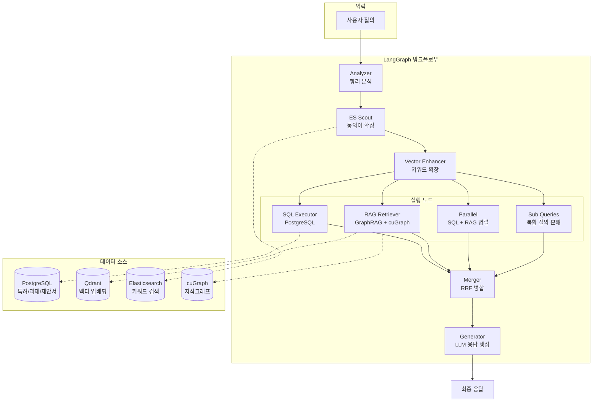

---

## 상태 머신 (AgentState)

LangGraph는 `AgentState` TypedDict를 통해 모든 노드 간 상태를 공유합니다.

### 핵심 상태 필드

| 필드 | 타입 | 설명 |
|------|------|------|
| `query` | str | 사용자 원본 질문 |
| `query_type` | Literal | sql / rag / hybrid / simple |
| `query_subtype` | Literal | list / aggregation / ranking / concept / compound / recommendation |
| `entity_types` | List[str] | 검색 대상 엔티티 (patent, project, equip, proposal) |
| `keywords` | List[str] | LLM 추출 핵심 키워드 |
| `expanded_keywords` | List[str] | 벡터+동의어 확장 키워드 |
| `sql_result` | SQLQueryResult | SQL 실행 결과 |
| `multi_sql_results` | Dict[str, SQLQueryResult] | 다중 엔티티별 SQL 결과 |
| `rag_results` | List[SearchResult] | RAG 검색 결과 |
| `response` | str | 최종 LLM 생성 응답 |
| `search_config` | SearchConfig | Phase 89 검색 전략 설정 |
| `context_quality` | float | 신뢰도 점수 (0.0~1.0) |

### 상태 흐름

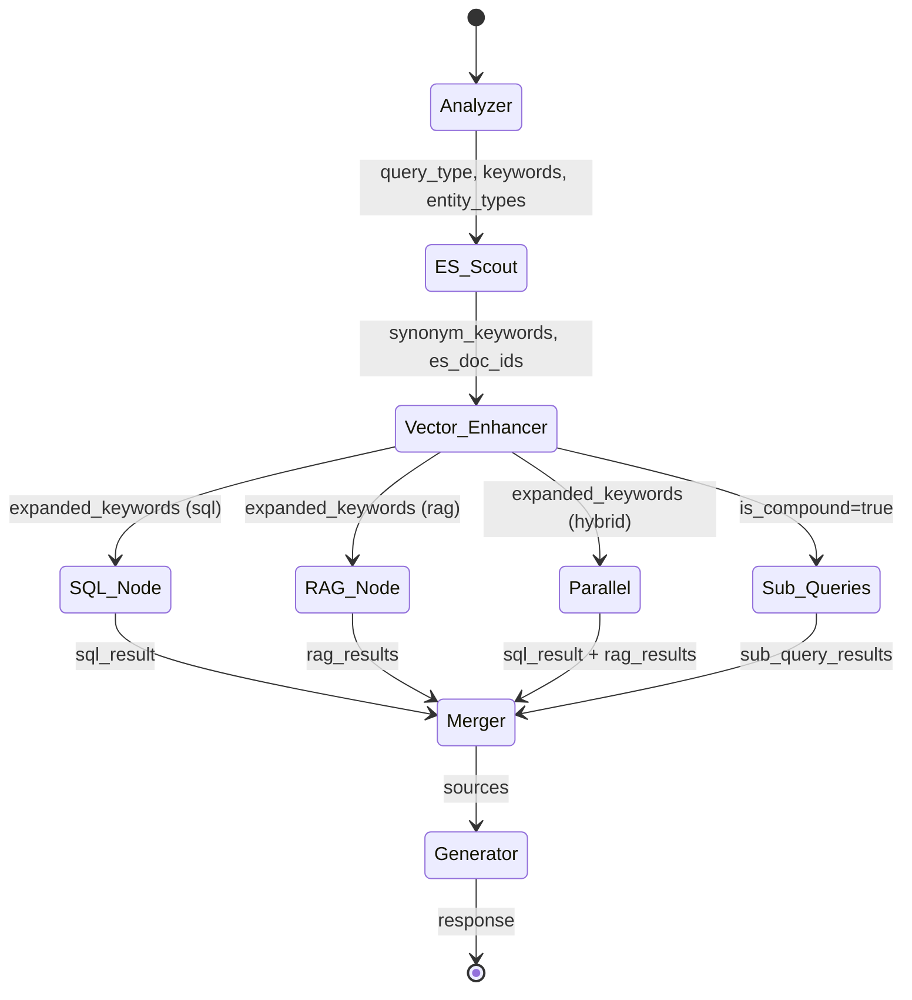

---

## 노드별 상세 설명

### 1. Analyzer (쿼리 분석)

**파일**: `workflow/nodes/analyzer.py`

**역할**: LLM을 사용하여 사용자 질의의 의도를 분석하고 분류합니다.

**동작 과정**:
1. 사용자 질문을 LLM에 전달
2. 쿼리 유형(sql/rag/hybrid/simple) 결정
3. 서브타입(list/aggregation/ranking/concept/compound) 분류
4. 핵심 키워드 추출
5. 엔티티 타입 추론 (patent, project, equip, proposal)
6. 복합 질의 시 sub_queries로 분해

**출력 상태**:
```python
{
    "query_type": "hybrid",
    "query_subtype": "list",
    "keywords": ["인공지능", "AI"],
    "entity_types": ["patent", "project"],
    "is_compound": True,
    "sub_queries": [
        {"intent": "특허 검색", "subtype": "list", "entity_types": ["patent"]},
        {"intent": "과제 검색", "subtype": "list", "entity_types": ["project"]}
    ]
}
```

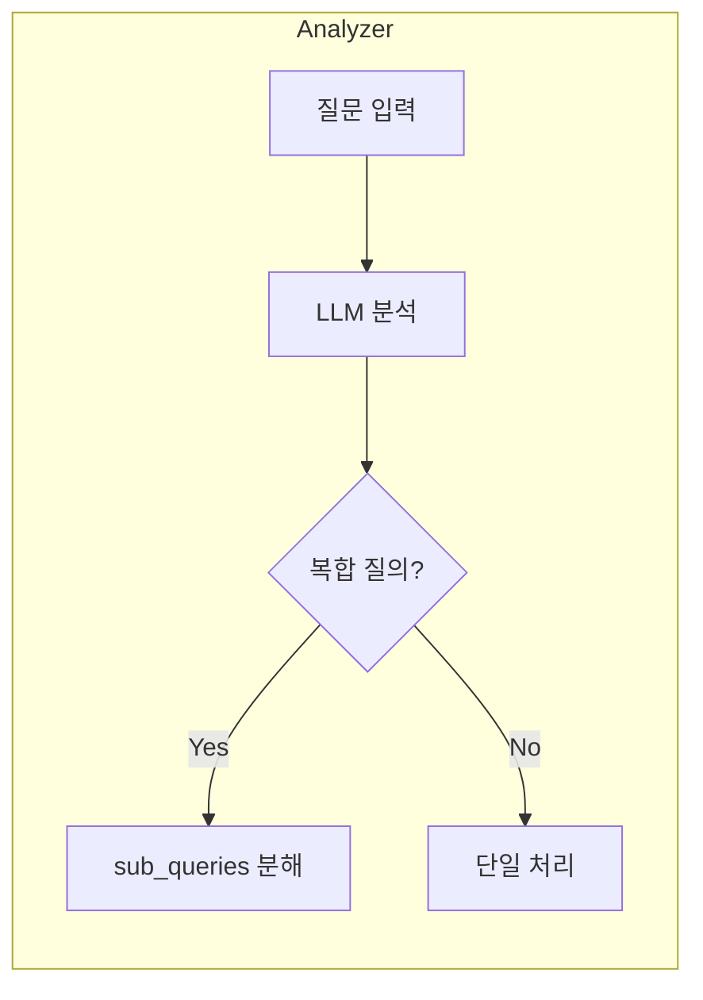

**엔티티 타입 추론 규칙 (Phase 104)**:
- 특허/발명/출원/IP → `patent`
- 과제/연구/프로젝트/R&D → `project`
- 장비/기자재/설비/분석기기 → `equip`
- 공고/제안/RFP/사업공고 → `proposal`
- 여러 유형 언급 시 모두 포함 (예: `["patent", "project"]`)

---

### 2. ES Scout (동의어 확장 및 도메인 탐색)

**파일**: `workflow/nodes/es_scout.py`

**역할**: 동의어 사전 기반 키워드 확장 및 Elasticsearch 검색으로 활성 도메인 식별

**동작 과정**:
1. 동의어 사전(`synonyms.txt`) 로드
2. 원본 키워드를 동의어로 확장
3. ES 검색으로 도메인별 문서 ID 수집
4. 활성 도메인(entity_types) 결정

**출력 상태**:
```python
{
    "keywords": ["인공지능", "AI", "artificial intelligence"],
    "synonym_keywords": ["artificial intelligence"],
    "es_doc_ids": {"patent": ["P001", "P002"], "project": ["J001"]},
    "domain_hits": {"patent": 150, "project": 80}
}
```

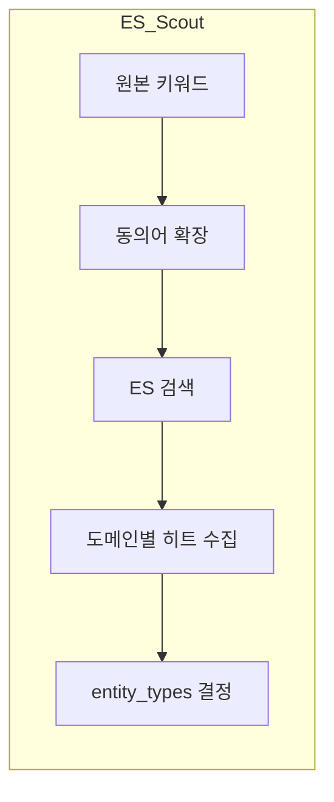

**환경 변수**: `ES_ENABLED=true` (비활성화 시 기본 entity_types 폴백)

---

### 3. Vector Enhancer (벡터 키워드 확장)

**파일**: `workflow/nodes/vector_enhancer.py`

**역할**: Qdrant 벡터 검색으로 의미론적 유사 키워드를 확장합니다.

**동작 과정**:
1. 질의를 벡터로 변환 (Sentence Transformer)
2. Qdrant에서 유사 문서 검색 (100개/컬렉션)
3. Komoran 형태소 분석으로 키워드 추출
4. LLM 키워드 + 벡터 확장 키워드 병합
5. 다중 엔티티 시 각각 독립 검색 (Phase 53)

**Qdrant 컬렉션 매핑**:

| 엔티티 | 컬렉션 |
|--------|--------|
| patent | patents_v3_collection |
| project | projects_v3_collection |
| equip | equipments_v3_collection |
| proposal | proposals_v3_collection |

**출력 상태**:
```python
{
    "expanded_keywords": ["인공지능", "AI", "딥러닝", "신경망"],
    "cached_vector_results": {...},
    "entity_keywords": {
        "patent": ["인공지능", "딥러닝"],
        "project": ["AI", "머신러닝"]
    }
}
```

---

### 4. SQL Executor (SQL 실행)

**파일**: `workflow/nodes/sql_executor.py`

**역할**: 자연어를 SQL로 변환하고 PostgreSQL에서 실행합니다.

**동작 과정**:
1. 쿼리 서브타입별 SQL 힌트 생성
2. LLM으로 자연어 → SQL 변환
3. PostgreSQL 실행
4. 다중 엔티티 시 병렬 실행 (ThreadPoolExecutor)

**테이블 매핑**:

| 엔티티 | 테이블 |
|--------|--------|
| patent | f_patents, f_patent_applicants, f_patent_ipc |
| project | f_projects, f_project_kwd |
| equip | f_equipments |
| proposal | f_proposals, f_proposal_details |

**서브타입별 SQL 패턴**:

| 서브타입 | SQL 패턴 |
|----------|----------|
| list | SELECT ... LIMIT 10 |
| aggregation | GROUP BY + COUNT/SUM |
| ranking | GROUP BY + ORDER BY DESC LIMIT 10 |
| trend_analysis | LEFT(date, 4) GROUP BY 연도 |

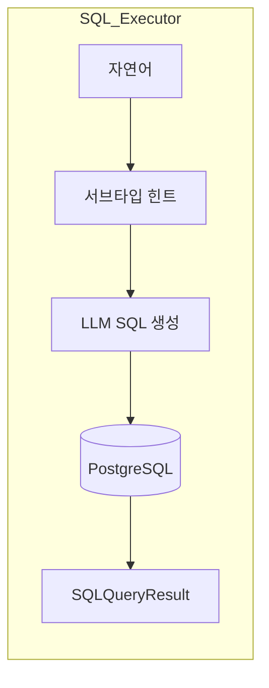

---

### 5. RAG Retriever (GraphRAG + cuGraph)

**파일**: `workflow/nodes/rag_retriever.py`

**역할**: 하이브리드 검색 (벡터 + 그래프 + ES)으로 관련 문서를 검색합니다.

**검색 전략 (GraphRAGStrategy)**:

| 전략 | 설명 |
|------|------|
| VECTOR_ONLY | Qdrant 벡터 검색만 |
| GRAPH_ONLY | cuGraph 그래프 탐색만 |
| HYBRID | 벡터 + 그래프 RRF 결합 |
| GRAPH_ENHANCED | 벡터 검색 후 그래프 확장 |

**cuGraph 지식그래프 구조**:

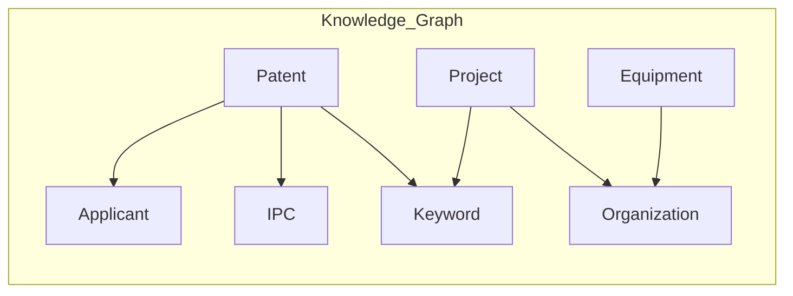

**동작 과정**:
1. 캐시된 벡터 결과 재사용 (vector_enhancer에서 전달)
2. cuGraph에서 그래프 탐색 (PageRank + 커뮤니티)
3. ES 키워드 검색 (보조)
4. RRF로 결과 병합

**RRF (Reciprocal Rank Fusion) 공식**:
```
score = Σ (1 / (k + rank + 1))
```
- k = 60 (기본값)
- 여러 소스의 순위를 통합하여 최종 점수 계산

---

### 6. Parallel (병렬 실행)

**파일**: `workflow/graph.py` - `_parallel_execution()`

**역할**: SQL과 RAG를 동시에 실행합니다.

**동작 과정**:
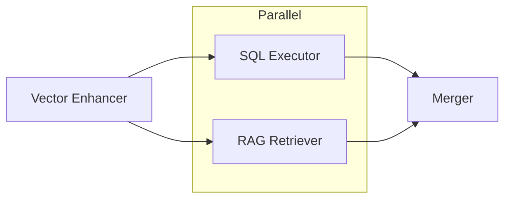

---

### 7. Sub Queries (복합 질의 분해)

**파일**: `workflow/graph.py` - `_execute_sub_queries()`

**역할**: 복합 질의를 하위 질의로 분해하여 각각 실행합니다.

**동작 과정**:
1. sub_queries 목록에서 하위 질의 추출
2. subtype → query_type 변환 (list→sql, concept→rag)
3. 독립 질의 병렬 실행 (ThreadPoolExecutor)
4. 의존 질의 순차 실행
5. 결과를 multi_sql_results로 통합

**예시 (특허 + 과제 검색)**:
```python
sub_queries = [
    {"intent": "특허 검색", "subtype": "list", "entity_types": ["patent"]},
    {"intent": "과제 검색", "subtype": "list", "entity_types": ["project"]}
]
```

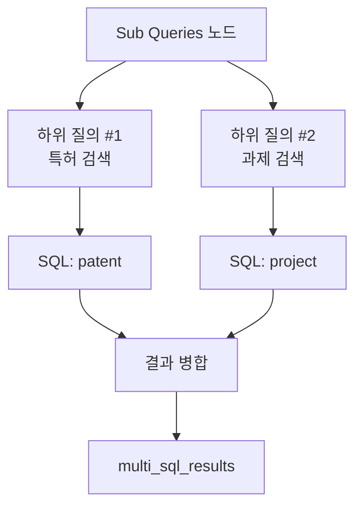

---

### 8. Merger (결과 병합)

**파일**: `workflow/nodes/merger.py`

**역할**: SQL + RAG 결과를 통합하고 중복을 제거합니다.

**동작 과정**:
1. query_type에 따른 처리 분기
2. 중복 엔티티 제거 (node_id 기준)
3. SearchConfig.merge_priority 기반 소스 정렬
4. complex_ranking인 경우 RRF 통합

**소스 우선순위 (기본값)**:
1. SQL (0)
2. ES (1)
3. Vector (2)
4. Graph (3)

---

### 9. Generator (응답 생성)

**파일**: `workflow/nodes/generator.py`

**역할**: LLM을 사용하여 최종 응답을 생성합니다.

**동작 과정**:
1. 컨텍스트 구축 (build_merged_context)
2. 리터러시 레벨(초등/일반인/전문가)에 맞춘 프롬프트
3. LLM 응답 생성
4. 신뢰도 점수 계산

**리터러시 레벨별 응답 스타일**:

| 레벨 | 특징 |
|------|------|
| 초등 | 쉬운 단어, 짧은 문장, 예시 활용 |
| 일반인 | 일반적인 설명, 핵심 정보 중심 |
| 전문가 | 기술적 세부사항, 수치 데이터 포함 |

**응답 형식 (다중 엔티티)**:

"수소연료전지 개발 역량을 보유한 기관" 같은 질의의 경우:

1. **특허 도메인 결과** (표 형식)
   - 출원기관, 특허명, 출원번호 등

2. **연구과제 도메인 결과** (표 형식)
   - 수행기관, 과제명, 연구기간 등

3. **취합 분석 (소결)**
   - 주요 역량 보유 기관 종합
   - 특허+과제 양쪽에 나타난 기관 분석

---

## 라우팅 로직

**파일**: `workflow/edges.py`

### ES Scout 이후 라우팅

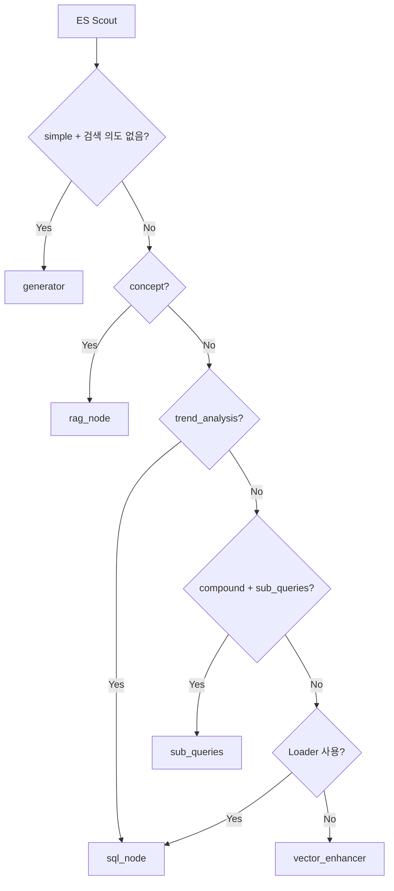

### Vector Enhancer 이후 라우팅

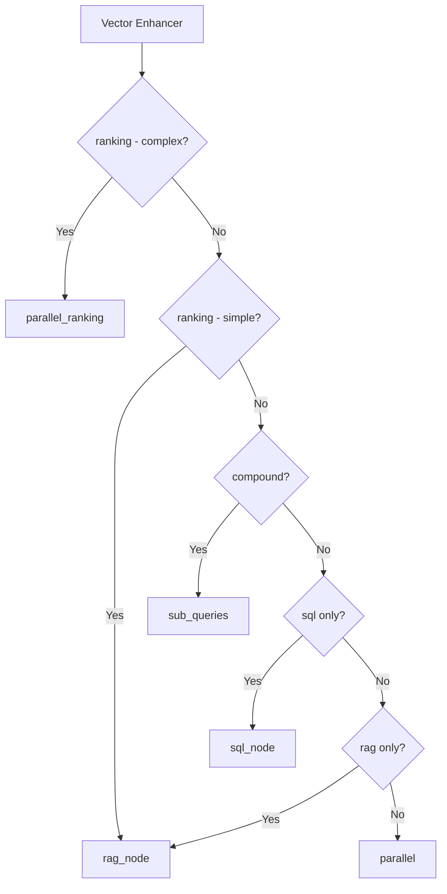

---

## 데이터 흐름 예시

### 예시 1: "인공지능 특허와 연구과제 검색"

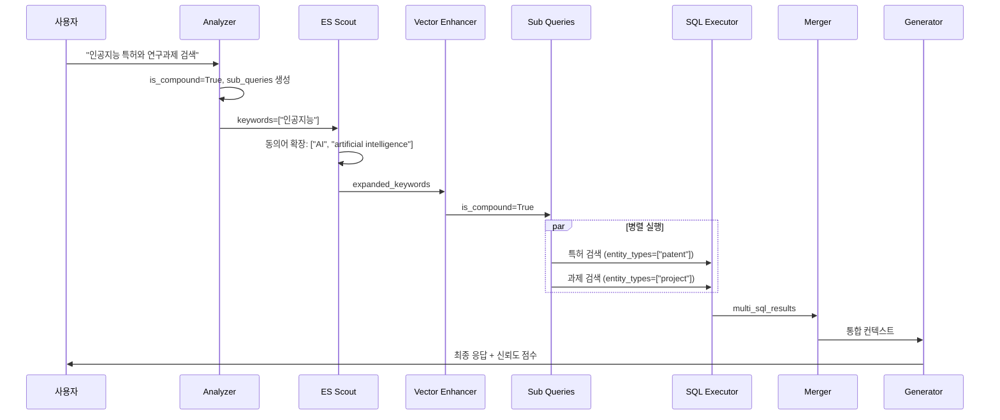

### 예시 2: "딥러닝 연구 동향"

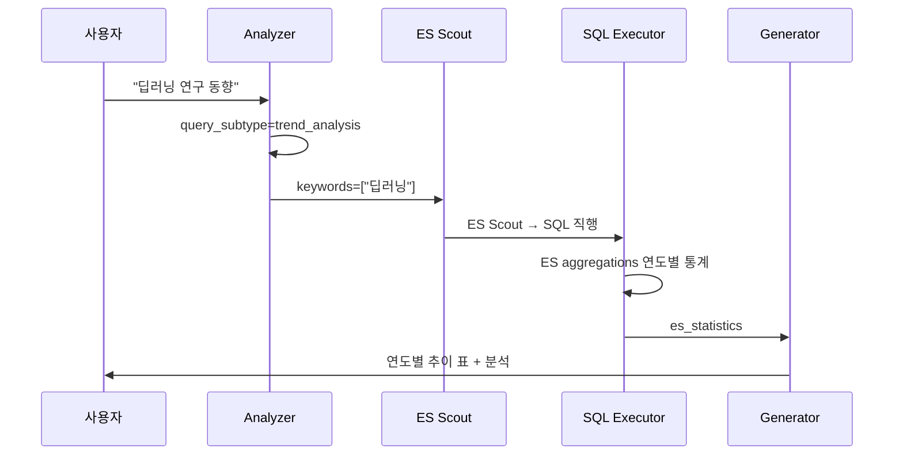

### 예시 3: "수소연료전지 개발 역량 보유 기관"

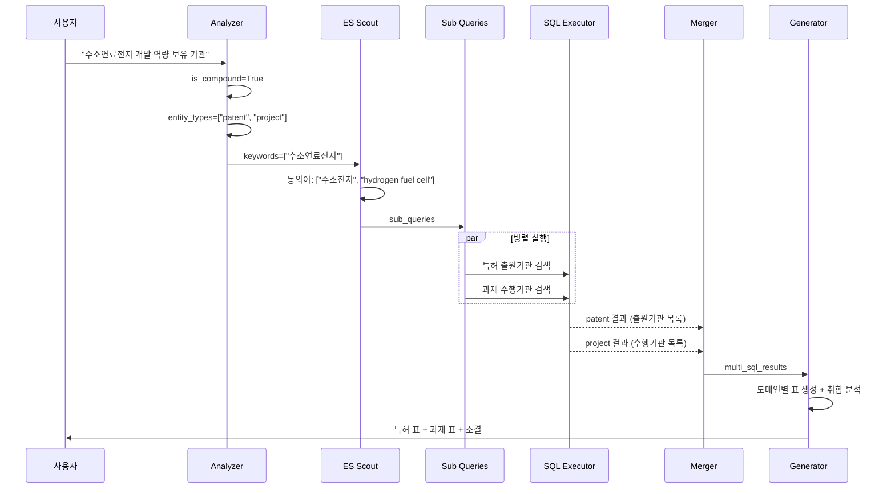

---

## 핵심 컴포넌트

### GraphRAG (graph/graph_rag.py)

Qdrant 벡터 검색 + cuGraph 지식그래프를 통합한 하이브리드 검색 시스템

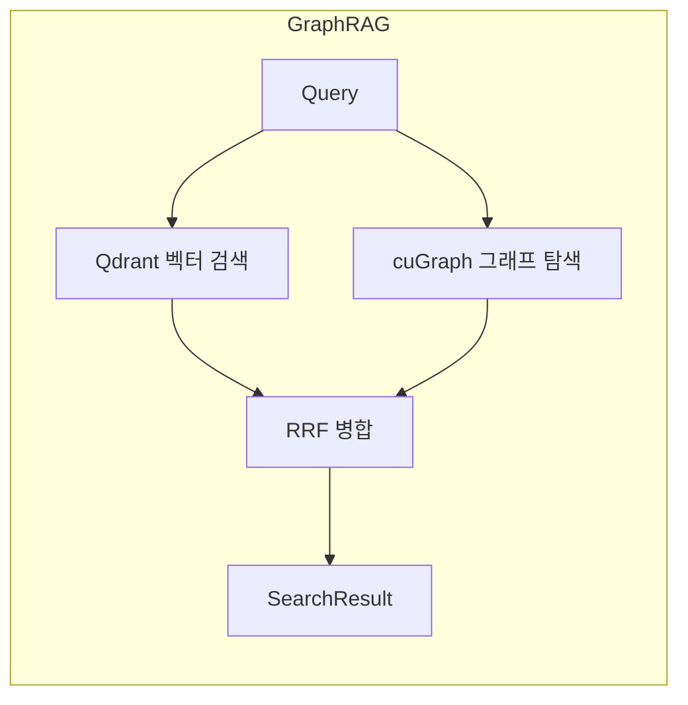

### cuGraph 지식그래프 (graph/cugraph_client.py)

GPU 가속 그래프 분석 (NVIDIA cuGraph)

- **PageRank**: 중요도 기반 노드 순위
- **Community Detection**: 관련 엔티티 클러스터링
- **Path Finding**: 엔티티 간 관계 탐색

### SQL Agent (sql/sql_agent.py)

LLM 기반 자연어 → SQL 변환

- 스키마 컨텍스트 자동 주입
- 쿼리 서브타입별 최적화된 SQL 패턴
- 에러 복구 및 재시도 로직

---

## 환경 설정

### 필수 환경변수

| 변수 | 설명 | 기본값 |
|------|------|--------|
| ES_ENABLED | Elasticsearch 활성화 | false |
| USE_REASONING_MODE | LLM 추론 모드 | false |
| OPENAI_API_KEY | OpenAI API 키 | - |
| POSTGRES_HOST | PostgreSQL 호스트 | localhost |
| QDRANT_HOST | Qdrant 호스트 | localhost |

### 서버 시작 명령

```bash
# ES 활성화하여 서버 시작
ES_ENABLED=true python3 -m uvicorn api.main:app --host 0.0.0.0 --port 8000
```

---

## 응답 형식 가이드

### 다중 도메인 검색 결과 (통합검색)

**기대 출력 형식**:

```markdown
## 특허 검색 결과

| 출원기관 | 특허명 | 출원번호 | 출원일 |
|----------|--------|----------|--------|
| 한국전력공사 | 수소연료전지 시스템 | 10-2023-0001234 | 2023-01-15 |
| 삼성전자 | 연료전지 스택 구조 | 10-2023-0002345 | 2023-02-20 |
| ... | ... | ... | ... |

## 연구과제 검색 결과

| 수행기관 | 과제명 | 연구기간 | 연구비 |
|----------|--------|----------|--------|
| KAIST | 고효율 수소연료전지 개발 | 2022-2025 | 50억 |
| 한국에너지기술연구원 | 차세대 연료전지 시스템 | 2023-2026 | 80억 |
| ... | ... | ... | ... |

## 종합 분석 (소결)

수소연료전지 개발 역량 보유 기관을 특허와 연구과제 양 측면에서 분석한 결과:

1. **한국전력공사**: 특허 15건, 과제 3건 수행 - 전력 분야 핵심 역량
2. **한국에너지기술연구원**: 특허 8건, 과제 5건 수행 - R&D 전문기관
3. **삼성전자**: 특허 12건 - 상용화 기술 보유

특허와 과제 양쪽에서 활발한 활동을 보이는 기관은 ...
```

---

## 버전 히스토리

| Phase | 주요 변경 |
|-------|----------|
| Phase 95 | Funnel Search, GraphRAG 도입 |
| Phase 96 | entity_types 비우기 정책 도입 |
| Phase 100 | ES Scout 노드 분리 |
| Phase 102 | 신뢰도 점수 추가 |
| Phase 103 | 리터러시 레벨별 응답 |
| Phase 104 | 다중 엔티티 compound 쿼리 지원 |
